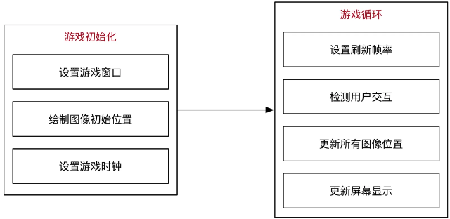

| 模块名           | 功能                       |
| ---------------- | -------------------------- |
| pygame.cdrom     | 访问光驱                   |
| pygame.cursors   | 加载光标                   |
| pygame.display   | 访问显示设备               |
| pygame.draw      | 绘制形状、线和点           |
| pygame.event     | 管理事件                   |
| pygame.font      | 使用字体                   |
| pygame.image     | 加载和存储图片             |
| pygame.joystick  | 使用游戏手柄或者类似的东西 |
| pygame.key       | 读取键盘按键               |
| pygame.mixer     | 声音                       |
| pygame.mouse     | 鼠标                       |
| pygame.movie     | 播放视频                   |
| pygame.music     | 播放音频                   |
| pygame.overlay   | 访问高级视频叠加           |
| pygame.rect      | 管理矩形区域               |
| pygame.sndarry   | 操作声音数据               |
| pygame.sprite    | 操作移动图像               |
| pygame.surface   | 管理图像和屏幕             |
| pygame.surfarray | 管理点阵图像数据           |
| pygame.time      | 管理时间和帧信息           |
| pygame.transform | 缩放和移动图像             |

## 01. 使用 `pygame` 创建图形窗口

### 1.1 游戏的初始化和退出

- 要使用 `pygame` 提供的所有功能之前，需要调用 `init` 方法
- 在游戏结束前需要调用一下 `quit` 方法

### 1.2 理解游戏中的坐标系

pygame.Rect()

~~~python
Rect(x,y,width,height) -> Rect
~~~

注意：pygame是一个比较特殊的类，内部只封装一些数字计算，不执行pygame.init()也能直接使用

注意：size属性返回的是元组，arg1：width，arg2：height

2、pygame.display()

pygame提供一个模块pygame.display用于创建、管理游戏窗口

| 方法                      | 说明               |
| ------------------------- | ------------------ |
| pygame.display.set_mode() | 初始化游戏显示窗口 |
| pygame.display.update()   | 刷新屏幕内容显示   |

#### set_mode方法

~~~python
set_mode(resolution=(0,0),flags=0.depth=0)
~~~

- **作用**：创建游戏显示窗口
- **参数**

- - `resolution` 指定屏幕的 `宽` 和 `高`，默认创建的窗口大小和屏幕大小一致

- - `flags` 参数指定屏幕的附加选项，例如是否全屏等等，默认不需要传递

- - `depth` 参数表示颜色的位数，默认自动匹配

- **返回值**

- - **暂时** 可以理解为 **游戏的屏幕**，**游戏的元素** 都需要被绘制到 **游戏的屏幕** 上

- **注意**：必须使用变量记录 `set_mode` 方法的返回结果！因为：后续所有的图像绘制都基于这个返回结果

~~~python
# 创建游戏主窗口
screen = pygame.display.set_mode((480, 700))
~~~

### 1.4 简单的游戏循环

- 为了做到游戏程序启动后，**不会立即退出**，通常会在游戏程序中增加一个 **游戏循环**

- 所谓 **游戏循环** 就是一个 **无限循环**

- 在 **创建游戏窗口** 代码下方，增加一个无限循环

- - 注意：**游戏窗口不需要重复创建**

~~~python
# 创建游戏主窗口
screen = pygame.display.set_mode((480, 700))

# 游戏循环
while True:
    pass
~~~

## 02. 理解 **图像** 并实现图像绘制

### 代码演练 I —— 绘制背景图像

**需求**

1. 加载 `background.png` 创建背景
2. 将 **背景** 绘制在屏幕的 `(0, 0)` 位置
3. 调用屏幕更新显示背景图像

~~~python
# 绘制背景图像
# 1> 加载图像
bg = pygame.image.load("./images/background.png")

# 2> 绘制在屏幕
screen.blit(bg, (0, 0))

# 3> 更新显示
pygame.display.update()
~~~

### 代码演练 II —— 绘制英雄图像

**需求**

1. 加载 `me1.png` 创建英雄飞机
2. 将 **英雄飞机** 绘制在屏幕的 `(200, 500)` 位置
3. 调用屏幕更新显示飞机图像

~~~python
# 1> 加载图像
hero = pygame.image.load("./images/me1.png")

# 2> 绘制在屏幕
screen.blit(hero, (200, 500))

# 3> 更新显示
pygame.display.update()
~~~

**透明图像**

- `png` 格式的图像是支持 **透明** 的
- 在绘制图像时，**透明区域** 不会显示任何内容
- 但是如果**下方已经有内容**，会 **透过** **透明区域** 显示出来

### 理解 `update()` 方法的作用

可以在 `screen` 对象完成 **所有** `blit` 方法之后，**统一调用一次** `display.update` 方法，同样可以在屏幕上 **看到最终的绘制结果**

- 使用 `display.set_mode()` 创建的 `screen` **对象** 是一个 **内存中的屏幕数据对象**
  - 可以理解成是 **油画** 的 **画布**
- `screen.blit` 方法可以在 **画布** 上绘制很多 **图像**
  - 例如：**英雄**、**敌机**、**子弹**...
  - **这些图像** 有可能 会彼此 **重叠或者覆盖**
- `display.update()` 会将 **画布** 的 **最终结果** 绘制在屏幕上，这样可以 **提高屏幕绘制效率**，**增加游戏的流畅度**

~~~python
# 绘制背景图像
# 1> 加载图像
bg = pygame.image.load("./images/background.png")

# 2> 绘制在屏幕
screen.blit(bg, (0, 0))

# 绘制英雄图像
# 1> 加载图像
hero = pygame.image.load("./images/me1.png")

# 2> 绘制在屏幕
screen.blit(hero, (200, 500))

# 3> 更新显示 - update 方法会把之前所有绘制的结果，一次性更新到屏幕窗口上
pygame.display.update()
~~~

## 03. 理解 **游戏循环** 和 **游戏时钟**

现在 **英雄飞机** 已经被绘制到屏幕上了，**怎么能够让飞机移动呢** ？

### 3.1 游戏中的动画实现原理

- 跟 **电影** 的原理类似，游戏中的动画效果，本质上是 **快速** 的在屏幕上绘制 **图像**
  - 电影是将多张 **静止的电影胶片** **连续、快速**的播放，产生连贯的视觉效果！
- 一般在电脑上 **每秒绘制 60 次**，就能够达到非常 **连续** **高品质** 的动画效果
  - 每次绘制的结果被称为 **帧 Frame**

### 3.2 **游戏循环**

#### 游戏的两个组成部分

**游戏循环的开始** 就意味着 **游戏的正式开始**

#### 游戏循环的作用

1. 保证游戏 **不会直接退出**
2. **变化图像位置** —— 动画效果
   - 每隔 `1 / 60 秒` 移动一下所有图像的位置
   - 调用 `pygame.display.update()` 更新屏幕显示
3. **检测用户交互** —— 按键、鼠标等...

### 3.3 游戏时钟

- `ygame` 专门提供了一个类 `pygame.time.Clock` 可以非常方便的设置屏幕绘制速度 —— **刷新帧率**
- 要使用 **时钟对象** 需要两步：
  1. 在 **游戏初始化** 创建一个 **时钟对象**
  2. 在 **游戏循环** 中让时钟对象调用 `tick(帧率)` 方法
- `tick` 方法会根据 **上次被调用的时间**，自动设置 **游戏循环** 中的延时

~~~python
# 3. 创建游戏时钟对象
clock = pygame.time.Clock()
i = 0

# 游戏循环
while True:

    # 设置屏幕刷新帧率
    clock.tick(60)

    print(i)
    i += 1
~~~

### 3.4 英雄的简单动画实现

**需求**

1. 在 **游戏初始化** 定义一个 `pygame.Rect` 的变量记录英雄的初始位置
2. 在 **游戏循环** 中每次让 **英雄** 的 `y - 1` —— 向上移动
3. `y <= 0` 将英雄移动到屏幕的底部

每一次调用 update() 方法之前，需要把 所有的游戏图像都重新绘制一遍,而且应该 最先 重新绘制 背景图像

~~~python
# 4. 定义英雄的初始位置
hero_rect = pygame.Rect(150, 500, 102, 126)

while True:

    # 可以指定循环体内部的代码执行的频率
    clock.tick(60)

    # 更新英雄位置
    hero_rect.y -= 1

    # 如果移出屏幕，则将英雄的顶部移动到屏幕底部
    if hero_rect.y <= 0:
        hero_rect.y = 700

    # 绘制背景图片
    screen.blit(bg, (0, 0))
    # 绘制英雄图像
    screen.blit(hero, hero_rect)

    # 更新显示
    pygame.display.update()
~~~

### 3.5 在游戏循环中 监听 事件

#### 事件 `event`

- 就是游戏启动后，**用户针对游戏所做的操作**
- 例如：**点击关闭按钮**，**点击鼠标**，**按下键盘**..

#### 监听

- 在 **游戏循环** 中，判断用户 **具体的操作*

只有 **捕获** 到用户具体的操作，才能有针对性的做出响应

#### 代码实现

- `pygame` 中通过 `pygame.event.get()` 可以获得 **用户当前所做动作** 的 **事件列表**
  - 用户可以同一时间做很多事情
- 提示：**这段代码非常的固定**，几乎所有的 `pygame` 游戏都 **大同小异**！

~~~python
# 游戏循环
while True:

    # 设置屏幕刷新帧率
    clock.tick(60)

    # 事件监听
    for event in pygame.event.get():

        # 判断用户是否点击了关闭按钮
        if event.type == pygame.QUIT:
            print("退出游戏...")

            pygame.quit()

            # 直接退出系统
            exit()
~~~

