## linux 发行版本

### Ubuntu、Centos、Redhat

- 常用的 Linux 操作系统都是基于 Linux 内核开发的
- Linux 内核是 Linux 操作系统管理硬件设备的核心程序

## Linux 命令

复制粘贴：ctrl+shift+c ctrl+shift+v 

1. 查看目录命令
   | 命令           | 说明                     |
   | -------------- | ------------------------ |
   | ls             | 查看当前路径下的目录信息 |
   | tree           | 以树状方式显示目录       |
   | pwd            | 查看当前目录路径         |
   | clear          | 清除终端内容             |
   | ctrl+shift+"+" | 放大窗口字体             |
   | ctrl+"-"       | 缩小窗口字体             |
| ll             | 显示详细文件信息         |
   

   
2. 切换目录命令
   | 命令    | 说明                 |
   | ------- | -------------------- |
   | cd 目录 | 切换到指定目录       |
   | cd ~    | 切换到当前用户主目录 |
   | cd ..   | 切换到上级目录       |
   | cd .    | 切换到当前目录       |
   | cd -    | 切换到上一次目录     |

   

3. 绝对路径和相对路径

   - 绝对路径：从根目录算起的路径叫绝对路径
   - 相对路径：从当前目录算起的路径叫相对路径
   - 代码编写中建议绝对路径（？

   

4. 创建、删除文件和目录命令

   | 命令                         | 说明                 |
   | ---------------------------- | -------------------- |
   | touch 文件名                 | 创建制定文件         |
   | mkdir 目录名                 | 创建目录（文件夹）   |
   | rm 文件名                    | 删除指定文件         |
   | rm 目录名 -r（循环递归拷贝） | 删除目录及里面的内容 |
   | rmdir 目录名                 | 删除（空）目录       |

   

5. 复制、移动文件和目录命令

   | 命令                                                         | 说明                       |
   | ------------------------------------------------------------ | -------------------------- |
   | cp 原文件 目的地址（无则是当前目录，则不能同名）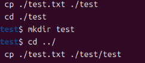 | 复制（拷贝）文件、拷贝目录 |
   | mv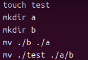 | 移动文件、移动目录、重命名 |

   
   
6. 终端命令格式的组成

   1. 终端命令格式说明

      command [-options] [parameter]

      - command：命令名，比如ls、pwd
      - [-options]：选项，可以有零个、一个或者多个，多个选项可以合并，比如-r；用于调整命令的功能
      - [parameter]：参数，可以有零个、一个或者多个，比如touch 文件名、mkdir 目录名、cd 目标目录（路径），这些文件名和目录名都是参数；命令的操作对象，一般是文件名或者目录名
      - []：代表可选

      

7. 查看命令帮助的方式

   | 命令帮助操作 | 说明           |
   | ------------ | -------------- |
   | --help       | command --help |
   | man          | man command    |

   man的操作键

   | 操作键 | 说明           |
   | ------ | -------------- |
   | 空格   | 显示下一屏信息 |
   | 回车   | 显示下一行信息 |
   | b      | 显示上衣屏信息 |
   | q      | 退出           |

## Tmux

## 命令选项

### 1、查看目录信息命令选项

1. ls命令选项

   | 命令选项 | 说明                       |
   | -------- | -------------------------- |
   | -l       | 以列表方式显示，默认是字节 |
   | -h       | 智能的显示文件大小         |
   | -a       | 显示隐藏文件和目录         |

   

### 2、创建、删除文件夹命令选项

1. mkdir命令选项

   | 命令选项                                                     | 说明                               |
   | ------------------------------------------------------------ | ---------------------------------- |
   | -p | 创建所依赖的文件夹（创建嵌套目录） |

   

2. rm命令选项

   | 命令选项 | 说明                                 |
   | -------- | ------------------------------------ |
   | -i       | 交互式提示                           |
   | -r       | 递归删除目录及内容                   |
   | -f       | 强制删除，忽略不存在的文件，无需提示 |

### 3、拷贝、移动文件和文件夹命令选项

1. cp命令选项

   | 命令选项                                                     | 说明                 |
   | ------------------------------------------------------------ | -------------------- |
   | -i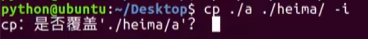 | 交互式提示           |
   | -r                                                           | 递归删除目录及内容   |
   | -v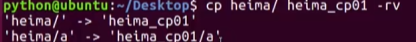 | 显示拷贝后的路径描述 |

2. mv命令选项

   | 命令选项                                                     | 说明                 |
   | ------------------------------------------------------------ | -------------------- |
   | -i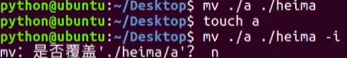 | 交互式提示           |
   | -v                                                           | 显示拷贝后的路径描述 |

## 工作常用命令

### 1、重定向命令

重定向也称为输出重定向，把在终端执行命令的结果保存到目标文件。

| 命令                                                         | 说明                                                         |
| ------------------------------------------------------------ | ------------------------------------------------------------ |
| >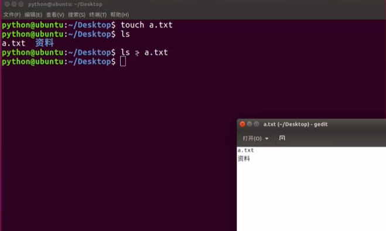 | 如果文件存在，会覆盖原有文件内容，相当于文件操作中的'w'模式 这里ls本来要将输出输出到终端中，但是用了>后输出到a.txt中 |
| >>                                                           | 如果文件存在，会追加写入文件末尾，相当于文件操作中的'a'模式  |

### 2、查看文件内容命令

| 命令                                                         | 说明                                                         |
| ------------------------------------------------------------ | ------------------------------------------------------------ |
| cat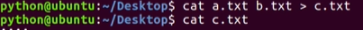 | 查看小型文件                                                 |
| more 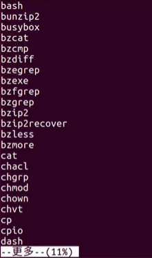 | 查看大型文件 回车 显示下一行信息 b  显示是上一屏信息 f  显示下一屏信息 q  退出 |
| \| | 管道，一个命令的输出可以通过管道作为另一个命令的输入，相当于一个容器 相当于将tree的内容在more中查看 |

### 3、链接命令

1. 软链接

   类似于Windows下的快捷方式，当一个源文件的目录层级比较深，想要方便使用它可以给源文件创建一个软链接

   | 命令                                                         | 说明                                                         |
   | ------------------------------------------------------------ | ------------------------------------------------------------ |
   | ln -s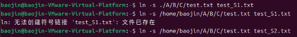 | 创建软链接 注意：如果是相对路径软链接，链接文件位置变化可能导致软链接不能使用 最好使用绝对路径创建软链接 原文件不存在则软链接不能用 |

   

### 4、查找文件内容命令

| 命令                                                         | 说明              |
| ------------------------------------------------------------ | ----------------- |
| grep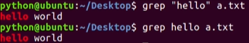 | 查找/搜索文件内容 |

| grep命令选项                                                 | 说明                               |
| ------------------------------------------------------------ | ---------------------------------- |
| -v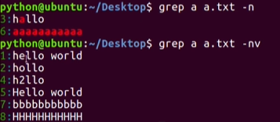 | 显示不包含匹配文本的所有行（除了） |
| -n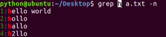 | 显示匹配行号                       |
| -i                                                           | 忽略大小写                         |

| grep结合正则表达式                                           | 说明                   |
| ------------------------------------------------------------ | ---------------------- |
| ^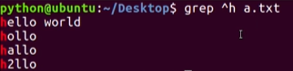 | 以指定字符串开头       |
| $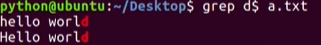 | 以指定字符串结尾       |
| .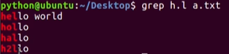 | 匹配一个非换行符的字符 |

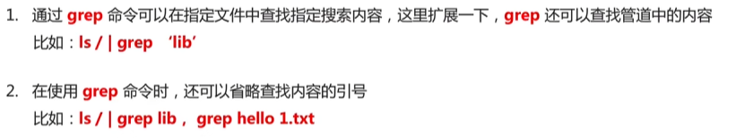

### 5、查找文件命令

1. find命令及选项的使用

   | 选项  | 说明               |
   | ----- | ------------------ |
   | -name | 根据文件名查找文件 |

2. 通配符

   | 通配符                                                       | 说明                  |
   | ------------------------------------------------------------ | --------------------- |
   | *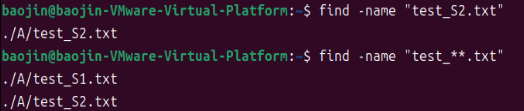 | 代表0个或多个任意字符 |
   | ? | 代表任意一个字符      |

   通配符不仅能结合find命令使用，还可以结合其他命令使用，比如：ls、mv、cp等，这里需要注意只有find命令使用通配符需要加上引号

   

### 6、压缩和解压缩命令

| 压缩格式 | 说明                                     |
| -------- | ---------------------------------------- |
| .gz      | 压缩包后缀（压缩快，但是压缩文件比较大） |
| .bz2     | 压缩包后缀（压缩慢，但是压缩文件比较小） |

| 命令 | 说明             |
| ---- | ---------------- |
| tar  | 压缩和解压缩命令 |

| tar命令选项 | 说明                               |
| ----------- | ---------------------------------- |
| -c          | 创建打包文件                       |
| -v          | 显示打包或者解包的详细信息         |
| -f          | 指定文件名称，必须放到所有选项后面 |
| -z          | 压缩（.gz）                        |
| -j          | 压缩（.bz2）                       |
| -x          | 解压缩                             |
| -C          | 解压缩到指定目录                   |

### 7、文件权限命令

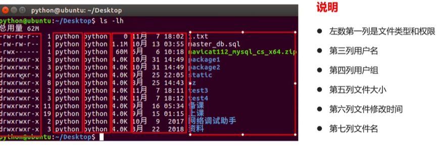

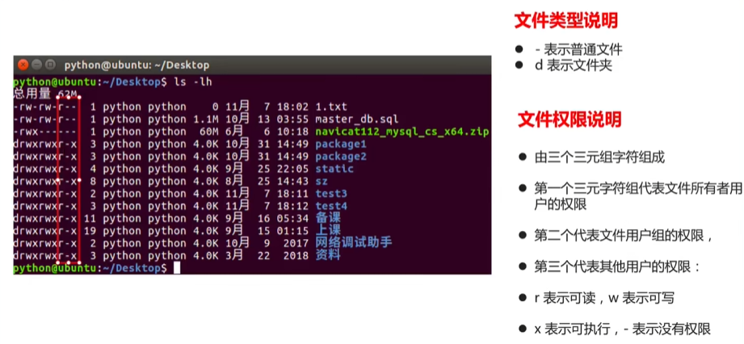

1. chmod 字母法

   格式：chmod u/g/o/a+/-/=rwx 文件名

   执行python文件时，可以python3 文件  / 可以在文件首行加入 #!python3位置（#!/user/bin/python3）

   | 角色                                                         | 说明                    |
   | ------------------------------------------------------------ | ----------------------- |
   | u | user 表示该文件的所有者 |
   | g                                                            | group 表示用户组        |
   | o                                                            | other 表示其他用户      |
   | a                                                            | all 表示所有用户        |

   | 操作符 | 说明     |
   | ------ | -------- |
   | +      | 增加权限 |
   | -      | 撤销权限 |
   | =      | 设置权限 |

   | 权限 | 说明     |
   | ---- | -------- |
   | r    | 可读     |
   | w    | 可写     |
   | x    | 可执行   |
   | -    | 无任何权 |

   

2. chmod数字法

   （格式：chmod 权限值 文件名）

   | 权限 | 说明                  |
   | ---- | --------------------- |
   | r    | 可读，权限是4         |
   | w    | 可写，权限是2         |
   | x    | 可执行，权限是1       |
   | -    | 无任何权限，权限值是0 |

   

   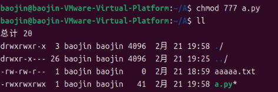

   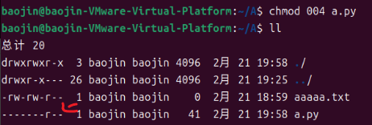

   （从后往前加）

   

### 8、获取管理员权限的相关命令

| 命令    | 说明                                                     |
| ------- | -------------------------------------------------------- |
| sudo -s | 切换到root用户，获取管理员权限 exit  退出当前用户   |
| sudo    | 某个命令的执行需要获取管理员权限可以在执行命令前加上sudo |

|
|
|
|
|

| 其他命令        | 说明                                             |
| --------------- | ------------------------------------------------ |
| whoami          | 看当前用户是谁                                   |
| who             | 看所有用户                                       |
| passwd          | 修改当前用户密码（可能会出现密码过于简单的情况） |
| which           | 查找命令位置                                     |
| shutdown -h now | 立刻关机                                         |
| reboot          | 重启                                             |

### 9、远程登录、拷贝命令

1. ssh命令的使用

   想要使用ssh服务，需要安装相应的服务端和客户端软件

   

   安装步骤：

   1. 假如Ubuntu作为服务端，需要安装ssh服务端软件。执行命令：sudo apt-get install openssh-server        service ssh restart
   2. 客户端电脑如果是macOS系统则不需要安装ssh客户端软件，默认已经安装过了，直接可以使用ssh命令
   3. 客户端电脑如果是Windows系统则需要安装OpenSSH for Windows这个软件

   连接步骤：

   1. 查看虚拟机ip地址：ipconfig 的 inet addr字段
   2. 在客户端输入 ssh 用户名@地址
   3. 输入密码连接

   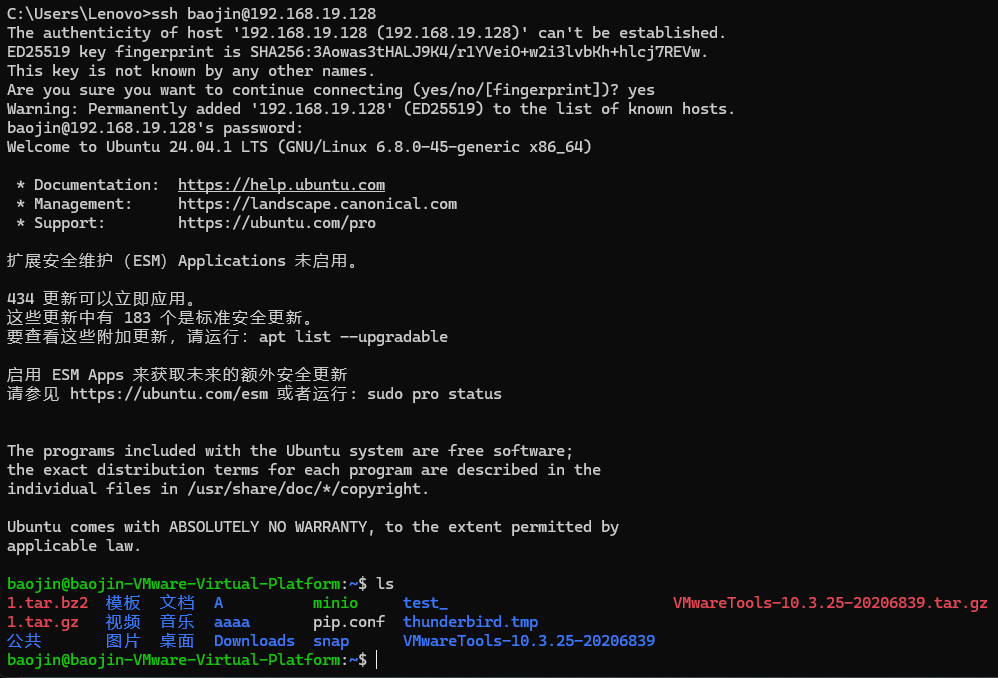

   

2. scp命令的使用（该命令应该在windows客户端运行，即要exit退出windows的远程连接）

   scp是基于ssh进行安全的远程文件拷贝的命令，也就是说需要保证服务端和客户端安装了相应的ssh软件

   scp命令格式：

   1. 远程拷贝文件：
      - scp 本地文件 远程服务器用户名@远程服务器ip地址:指定拷贝到远程服务器的路径
      - scp 远程服务器用户名@远程服务器ip地址:远程服务器文件 指定拷贝到本地的路径
   2. 远程拷贝目录
      - scp -r 本地目录 远程服务器用户名@远程服务器ip地址:指定拷贝到远程服务器的路径
      - scp -r 远程服务器用户名@远程服务器ip地址:远程服务器目录 指定拷贝到本地的路径
      - -r 表示递归拷贝整个目录

3. FileZilla软件的使用

   **FileZilla**是一个免费开源的FTP软件，可以可视化方式上传和下载文件

## 软件安装和卸载

### 1、软件安装

| 安装方式 | 说明            |
| -------- | --------------- |
| 离线安装 | deb文件格式安装 |
| 在线安装 | apt-get方式安装 |

1. deb文件格式安装

   是Ubuntu的安装包格式，可以使用dokg命令进行软件的安装和卸载

   | 命令                   | 说明              |
   | ---------------------- | ----------------- |
   | sudo dpkg -i deb安装包 | 离线安装deb安装包 |

   

2. apt-get方式安装

   是在线安装deb软件包的命令，主要用于在线从互联网的软件仓库中搜素、安装、升级、卸载软件

   | 命令                        | 说明              |
   | --------------------------- | ----------------- |
   | sudo apt-get install 安装包 | 在线安装deb安装包 |

   

3. 更改镜像源

   因为使用apt-get命令默认是从国外的服务器下载安装软件，所以下载慢需要更改成国内的镜像源服务器

### 2、软件卸载

| 卸载方式         | 说明              |
| ---------------- | ----------------- |
| 离线安装包的卸载 | deb文件格式卸载   |
| 在线安装包的卸载 | apt-get  方式卸载 |

1. deb文件格式卸载

   命令：sudo dpkg -r 安装包名

2. apt-get 方式卸载

   命令：sudo apt-get remove 安装包名

## vim

### 1、vim介绍

1. 什么是vim

   vim是一款功能强大的文本编辑器，也是早年Vi编辑器的加强版，特色就是使用命令进行编辑，完全脱离了鼠标操作。

2. vim工作模式

   1. 注意：vim打开文件进入的是命令模式
   2. 注意：编辑模式和末行模式之间不能直接切换，都需要通过命令模式来完成

   

   - 命令模式

   - 编辑模式

   - 末行模式

     | 末行模式命令                                                 | 说明                                                         |
     | ------------------------------------------------------------ | ------------------------------------------------------------ |
     | :w                                                           | 保存                                                         |
     | :wq                                                          | 保存退出                                                     |
     | :x                                                           | 保存退出                                                     |
     | :q! | 强制退出 注意：只用q也能退出，但是只能在文件已保存的情况下，q!是强制退出 |

     

   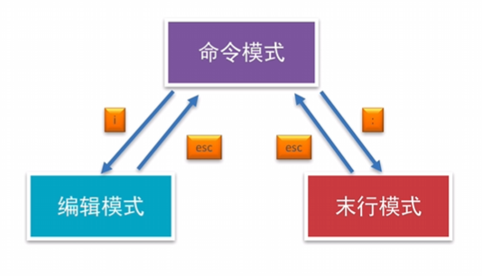

### 2、vim常用命令

vim中永久显示行号：在终端`vim ~/.vimrc` ，在打开的vimrc文件中最后一行输入：set number 或者 set nu，然后保存退出。

vim搜索设置高亮：linux vim打开文档搜索字符串时，设置被搜索到字符串高亮显示。1、临时设置：vim打开文档-->命令行形式输入 set hlsearch。2、永久设置（推荐）：在~/.vimrc中配制vim ~/.vimrc，在文件中加上set hlsearch ，然后保存退出便可。

| 命令                                          | 说明                                                |
| --------------------------------------------- | --------------------------------------------------- |
| yy                                            | 复制光标所在行                                      |
| p                                             | 粘贴 （n）p粘贴n行                             |
| dd                                            | 删除/剪切当前行                                     |
| V                                             | 按行选中 注意：v与V不一样                      |
| u                                             | 撤销                                                |
| ctr+r                                         | 反撤销                                              |
| G                                             | 回到最后一行                                        |
| gg                                            | 回到第一行                                          |
| 数字+G                                        | 回到指定行                                          |
| :/搜索的内容                                  | 搜索指定内容 搜索找到之后按n，会遍历找到的内容 |
| :%s/要替换的内容/替换后的内容/g               | 全局替换                                            |
| .                                             | 重复上一次命令操作                                  |
| >>                                            | 往右缩进                                            |
| <<                                            | 往左缩进                                            |
| :开始行数,结束行数s/要替换的内容/替换后的内容 | 局部替换                                            |
| shift+6                                       | 回到当前行行首                                      |
| shift+4                                       | 回到当前行行末                                      |
| ctr+f                                         | 下一屏                                              |
| ctr+b                                         | 上一屏                                              |

## 多任务、进程

### 1、多任务介绍

1. 多任务概念

   多任务是指在同一时间内执行多个任务

   例如：现在电脑安装的操作系统都是多任务操作系统，可以同时运行多个软件

2. 多任务两种表现形式

   - 并发

     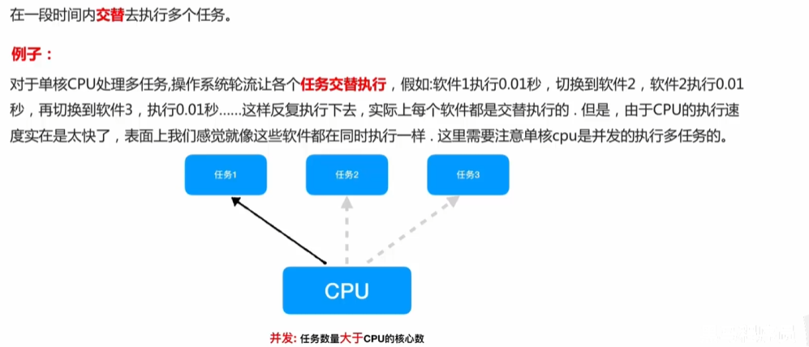

   - 并行

     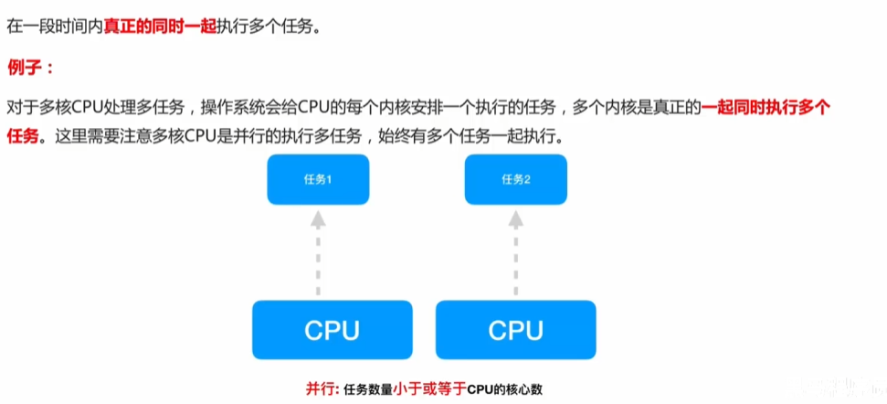

3. 要点：

   1. 使用多任务能充分利用CPU资源，提高程序执行效率，让你的程序具备处理多个任务的能力
   2. 多任务执行方式有两种：
      - 并发：在一段时间内交替执行多个任务
      - 并行：在一段时间内真正的同时一起执行多个任务

### 2、进程介绍

1. 程序中实现多任务的方式

   在Python中，想要实现多任务可以使用进程完成 

2. 进程概念

   进程（Process）是资源分配的最小单位，是操作系统进行资源分配和调度运行的基本单位，通俗理解：一个正在运行的程序就是一个进程

   例如：正在运行的qq，微信等，都是进程

   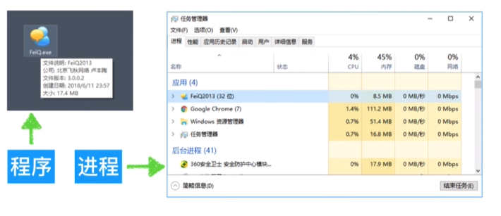 

3. 多进程作用

   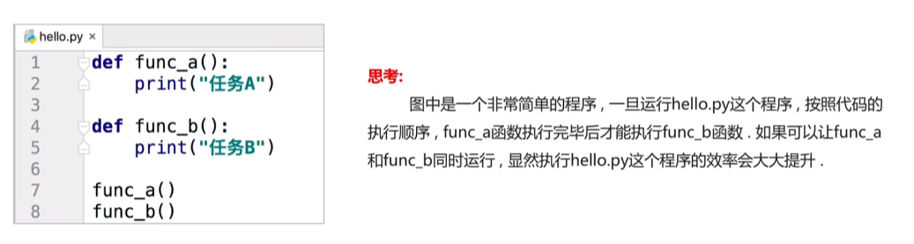

   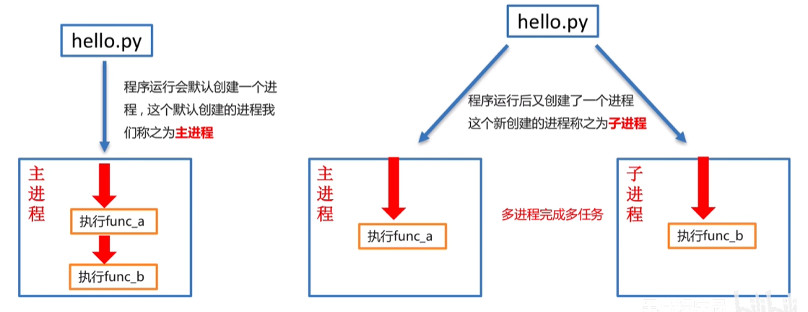

4. 知识要点

   1. 进程（Process）是资源分配的最小单位

   2. 多进程是Python程序中实现多任务的一种方式，使用多进程可以大大提高程序的执行效率

      

### 3、多进程完成多任务

1. 进程的创建步骤

   1. 导入进程包

      import multiprocessing

   2. 通过进程类创建进程对象

      进程对象 = multiprocessing.Process()

   3. 启动进程执行任务

      进程对象.start()

2. 通过进程类创建进程对象

   进程对象 = multiprocessing.Process(target = 任务名)

   | 参数名 | 说明                                       |
   | ------ | ------------------------------------------ |
   | target | 执行目标任务名，这里指的是函数名（方法名） |
   | name   | 进程名，一般不用设置                       |
   | group  | 进程组，目前只能使用None                   |

3. 进程创建与启动的代码

   ~~~python
   # 创建子进程
   coding_process = multiprocessing.Process(target=coding)
   # 创建子进程
   music_process = multiprocessing.Process(target=music)
   # 启动进程
   coding_process.start()
   music_process.strat()
   ~~~

   

### 4.进程执行带有参数的任务

1. 两个参数名

   | 参数名 | 说明                       |
   | ------ | -------------------------- |
   | args   | 以元组的方式给执行任务传参 |
   | kwargs | 以字典的方式给执行任务传参 |

2. args参数的使用

   ~~~python
   # target：进程执行的函数名
   # args：表示以元组的方式给函数传参(一定要加,  说明是以元组方式传参)
   conding_process = multiprocessing.Process(target=coding,args=(3,))
   coding_process.start()
   ~~~

3. kwargs参数的使用

   ~~~python
   # target：进程执行的函数名
   # args：表示以字典的方式给函数传参
   music_process = multiprocessing.Process(target=music,kwargs={"num":3})
   music_process.start()
   ~~~

### 5、获取进程编号

1. 进程编号的作用：

   当程序中进程的数量越来越多，就无法区分主进程和子进程还有不同的子进程。实际上为了方便管理每个进程都是有自己的编号的，通过获取进程编号就可以快速区分不同进程

2. 获取进程编号：

   ~~~python
   # 获取当前进程编号
   getpid()
   # 获取当前父进程编号
   getppid()
   ~~~

3. os.getpid()使用

   ~~~python
   import os
   def work():
       # 获取当前进程的编号
       print("work进程编号：",os.getpid())
       # 获取当前父进程的编号
       print("work父进程编号：",os.getppid())
   ~~~

### 6、进程间不共享全局变量

进程间是不共享全局变量的。

实际上创建一个子进程就是把主进程的资源进行拷贝产生一个新进程，这里主进程和子进程是**互相独立**的

~~~python
import multiprocessing

# 全局变量
my_list = []
def write_data(my_list):
  # 遍历从0到9的整数
  for i in range(10):
    # 将当前整数添加到列表my_list中
    my_list.append(i)
    # 打印当前写入的数据
    print("写入数据：", i)
  # 打印最终列表的内容
  print(my_list)
def read_data(my_list):
  print(my_list)

if __name__ == '__main__':
  # 创建写入数据进程
  write_process = multiprocessing.Process(target=write_data, args=(my_list,))
  read_process = multiprocessing.Process(target=read_data, args=(my_list,))
  # 创建读取数据进程
  write_process.start()
  read_process.start()
  # 等待写入数据进程结束
  write_process.join()
  # 等待读取数据进程结束
  read_process.join()
~~~

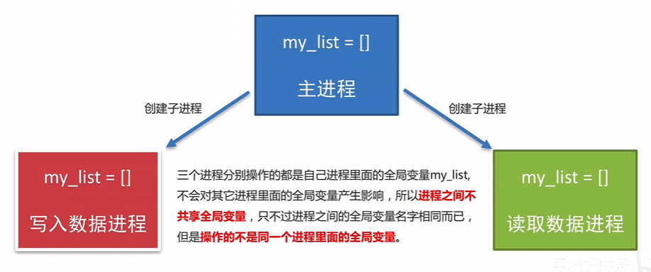

创建子进程会对主进程资源进行拷贝，也就是说子进程是主进程的一个副本，好比是一对双胞胎，之所以进程之间不共享全局变量，是因为操作的不是同一个进程里面的全局变量，只不过不同进程里面的全局变量名字相同而已

### 7、主进程和子进程的结束顺序

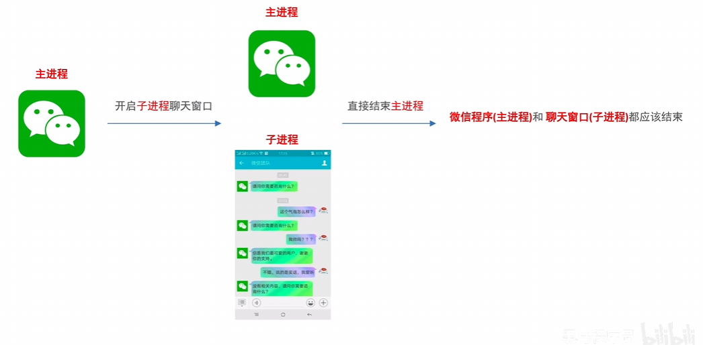

1. 主进程会等所有子进程执行结束再结束（电脑会等所有程序关闭完之后再关闭）

   ~~~python
   import multiprocessing
   import time
   
   # 工作函数
   def work():
     for i in range(10):
       print("子进程正在工作:", i)
       time.sleep(0.2)
   
   if __name__ == '__main__':
     # 创建子进程
     work_process = multiprocessing.Process(target=work)
     # 启动子进程
     work_process.start()
   
     # 延时一秒钟
     time.sleep(1)
     print("主进程结束")
   ~~~

2. 设置守护主进程

   ~~~python
   import multiprocessing
   import time
   
   # 工作函数
   def work():
     for i in range(10):
       print("子进程正在工作:", i)
       time.sleep(0.2)
   
   if __name__ == '__main__':
     # 创建子进程
     work_process = multiprocessing.Process(target=work)
     # 1.设置守护主进程,主进程退出后子进程直接销毁，不再执行子进程中的代码
     work_process.daemon = True
     # 启动子进程
     work_process.start()
   
     # 延时一秒钟
     time.sleep(1)
   
     # 2.手动销毁子进程
     work_process.terminate()
     
     print("主进程结束")
   ~~~

## 线程

### 1、线程的介绍

1. 实现多任务的另一种形式

   在Python中，想要实现多任务还可以使用**多线程**来完成

2. 为什么使用多线程

   进程是**分配资源**的最小单位，一旦创建一个线程就会分配一定的资源，就像跟两个人聊QQ就需要打开两个QQ软件一样是比较浪费资源的。

   线程是**程序执行**的最小单位，实际上进程只负责分配资源，而利用这些资源执行程序的是线程，也就是说进程是线程的容器，**一个进程中最少有一个线程**来负责执行程序，同时线程自己不拥有系统资源，只需要一点在运行中必不可少的资源，但它可与同属一个进程的其他线程**共享进程所拥有的全部资源**，这就像通过一个QQ软件（一个进程）打开两个窗口（两个）线程跟两个人聊天一样，实现多任务的同时也节省了资源。

3. 多线程的作用

   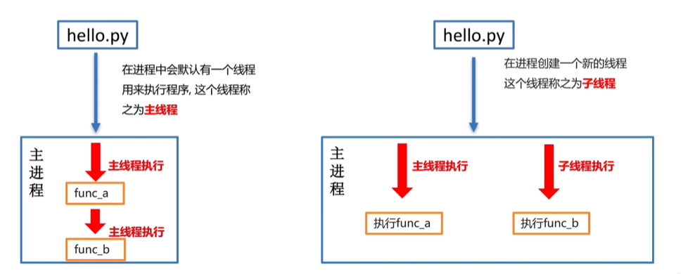

4. 知识要点：

   - 多线程是python程序中实现多任务的一种方式
   - 线程是**程序执行**的最小单位
   - 同属一个进程的多个线程**共享进程所拥有的全部资源**

   

### 2、多线程完成多任务

1. 线程创建步骤

   1. 导入线程模块

      import threading

   2. 通过线程类创建线程对象

      线程对象 = threading.Thread(target=任务名)

   3. 启动线程执行任务

      线程对象.start()

2. 通过线程类创建线程对象

   线程对象 = threading.Thread(target=任务名)

   | 参数名 | 说明                     |
   | ------ | ------------------------ |
   | target | 执行的目标任务名         |
   | name   | 线程名，一般不用设置     |
   | group  | 线程组，目前只能使用None |

3. 线程创建与启动的代码

   ~~~python
   import time
   import threading
   # 编写代码
   def coding():
     for i in range(10):
       print("正在写代码...")
       time.sleep(0.2)
   
   def music():
     for i in range(10):
       print("正在弹奏音乐...")
       time.sleep(0.2)
   
   if __name__ == '__main__':
     # coding()
     # music()
   
     # 创建两个线程
     coding_thread = threading.Thread(target=coding)
     music_thread = threading.Thread(target=music)
   
     # 启动子线程执行任务
     coding_thread.start()
     music_thread.start()
   ~~~

### 3、线程执行带有参数的任务

1. 线程执行带有参数的任务

   | 参数名 | 说明                       |
   | ------ | -------------------------- |
   | args   | 以元组的方式给执行任务传参 |
   | kwargs | 以字典的方式给执行任务传参 |

2. args参数的使用

   ~~~python
   # target：线程执行的函数名
   # args：表示以元组方式给函数传参
   coding_thread = threading.Thread(target=coding,args=(3,))
   coding_thread.start()
   
   # target：线程执行的函数名
   # kwargs：表示以元组方式给函数传参
   music_thread = threading.Thread(target=music,kwargs=("count",3))
   music_thread.start()
   ~~~

### 4、主线程和子线程的结束顺序

对比进程

1. 主线程会等待所有子线程执行结束后主线程再结束

   ~~~python
   import time
   import threading
   # 工作函数
   def work():
     for i in range(5):
       print("子线程正在工作", i)
       time.sleep(0.2)
   
   if __name__ == '__main__':
     # 创建子线程
     work_thread = threading.Thread(target=work)
     # 启动子线程
     work_thread.start()
   
     time.sleep(1)
     print("主线程结束")
   ~~~

2. 设置守护主线程

   ~~~python
   import threading
   import time
   
   # 工作函数
   def work():
     for i in range(10):
       print("子进程正在工作:", i)
       time.sleep(0.2)
   
   if __name__ == '__main__':
     # 创建子线程
     # 1.设置守护主进程,主进程退出后子进程直接销毁，不再执行子进程中的代码
     work_thread = threading.Thread(target=work,daemon=True)
     # work_thread = threading.Thread(target=work)
     # 启动子进程
     work_thread.start()
     # 2.方法设置
     # work_thread.setDaemon(True)# 已弃用
     # 延时一秒钟
     time.sleep(1)
     print("主进程结束")
   ~~~

### 5、线程之间执行的执行顺序

1. 线程之间执行是无序的

2. 获取当前线程信息

   ~~~python
   import threading
   import time
   # 获取线程信息
   def get_info():
     time.sleep(0.5)
     # 获取线程信息
     current_thread = threading.current_thread()
     print("线程信息：", current_thread)
   
   if __name__ == '__main__':
     for i in range(10):
       # 创建子线程
       sub_thread = threading.Thread(target=get_info)
       sub_thread.start()
   
   ~~~

   

### 6、线程之间共享全局变量

1. 线程之间共享全局变量

   多个线程都是在同一个进程中，多个线程使用的资源都是同一个进程中的资源，因此多线程间是共享全局变量

   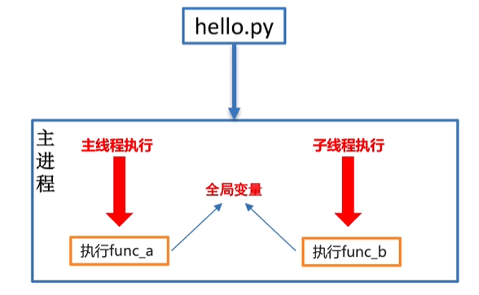

   ~~~python
   import time
   import threading
   # 全局变量
   my_list = []
   
   # 写入数据
   def write_data():
     for i in range(10):
       print("写入数据：", i)
       my_list.append(i)
     print("write",my_list)
   
   def read_data():
     print("read",my_list)
   
   if __name__ == '__main__':
     write_thread = threading.Thread(target=write_data)
     read_thread = threading.Thread(target=read_data)
     write_thread.start()
     time.sleep(1)
     read_thread.start()
     write_thread.join()
     read_thread.join()
   ~~~

2. 线程之间共享全局变量数据出现错误问题

   ~~~python
   import threading
   # 全局
   g_num = 0
   
   # 对g_num进行加1操作
   def add_num():
     for i in range(1000000):
       global g_num
       g_num += 1
     print("g_num:",g_num)
   
   # 对g_num进行加1操作
   def add_num1():
     for i in range(1000000):
       global g_num
       g_num += 1
     print("g_num:",g_num)
   
   if __name__ == '__main__':
     add_num_thread = threading.Thread(target=add_num)
     add_num1_thread = threading.Thread(target=add_num1)
   
     add_num_thread.start()
     add_num1_thread.start()
   ~~~

   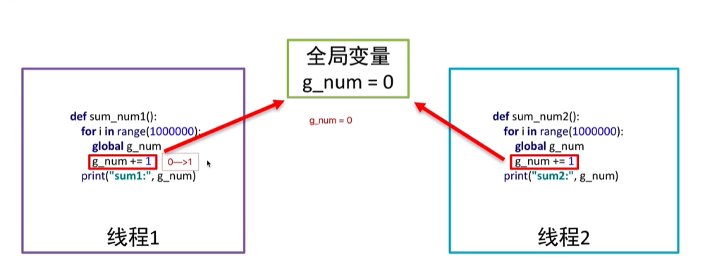

   解决办法：

   ​	同步：就是协同步调，按预定的先后次序进行运行。好比生活中对讲机，你说完我再说。

   ​	使用线程同步，保证同一时刻只能有一个线程去操作全局变量

   ​	线程同步方式：互斥锁

   

### 7、互斥锁的使用

1. 互斥锁介绍

   互斥锁：对共享数据进行锁定，保证同一时刻只有一个线程去操作

   注意：互斥锁是多个线程一起去抢，抢到锁的线程先执行，没抢到锁的线程等待，等锁使用完释放后，其他等待的线程再去抢这个锁。

2. 互斥锁使用

   1. 互斥锁创建：mutex = threading.Lock()
   
   2. 上锁：muteax.acquire()
   
   3. 释放锁：mutex.release()
   
      

### 8、死锁

一直等待对方释放锁的场景就是死锁：会造成应用程序停止响应，不能再去处理其他任务，注意在合适的地方释放锁

### 9、进程和线程对比

1. 关系对比
   1. 线程依附在进程里面，没有进程就没有线程
   2. 一个进程默认提供一条线程，进程可以创建多个线程
2. 区别对比
   1. 进程之间不共享全局变量
   2. 线程之间共享全局变量，但是要注意资源竞争问题，解决方法：互斥锁或者线程同步
   3. 创建进程的资源开销要比创建线程的资源开销大
   4. 进程是操作系统资源分配的基本单位，线程是CPU调度的基本单位
   5. 线程不能独立执行，必须依存在进程中
3. 优缺点对比
   1. 进程优缺点
      - 优点：可以多核
      - 缺点：资源开销大
   2. 线程优缺点
      - 优点：资源开销小
      - 缺点：不能使用多核

## TCP等

### 1、网络介绍

1. 网络的概念

    将具有独立功能的多台计算机通过通信线路和通信设备连接起来，在网络管理软件及网络通信协议下，实现资源共享和信息传递的虚拟平台。

### 2、IP地址介绍

1. IP地址介绍：

   IP地址是分配给网络设备上网使用的数字标签，它能标识网络中的唯一一台设备，好比每个人有一个手机号

   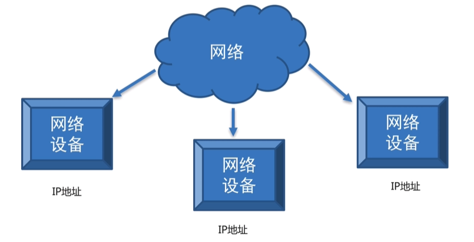

2. IP地址表现形式

   - IP地址分为两类：IPV4和IPV6

   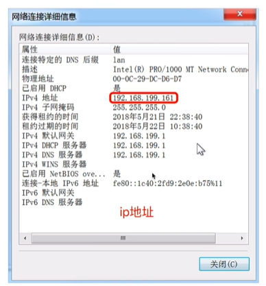

3. IP地址作用

   通过IP地址找到网络中唯一一台设备，然后可以跟这个设备进行数据通信

   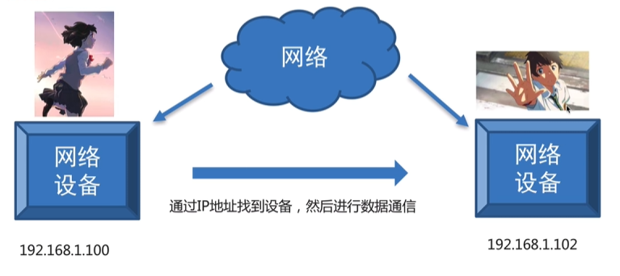

### 3、ifconfig和ping命令

| 命令名   | 说明                                                         |
| -------- | ------------------------------------------------------------ |
| ifconfig | 查看网卡信息 查看ip地址 windows是ipconfig          |
| ping     | 检查网络是否正常 ping localhost  //畅通则本机网络没问题 |

### 4、端口和端口号的介绍

如果在一台电脑上使用飞书给另一台电脑上飞书发送数据并给另外的这台电脑还运行着多个软件，它是如何区分这多个软件把数据给飞书的呢？

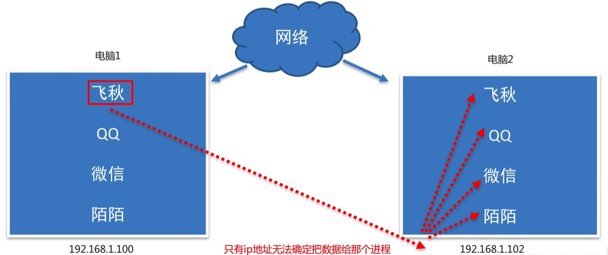

 其实，每运行一个程序都会有一个端口，想要给对应的程序发送数据，找到对应端口即可

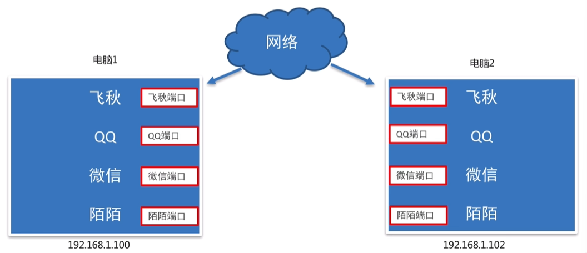

什么是端口？

​	端口是**传输数据的通道**，好比是教室的门，是数据传输必经之路

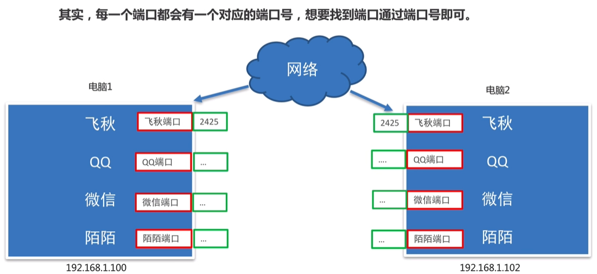

什么是端口号？

​	操作系统为了统一管理这么多端口，就对端口进行了编号，这就是端口号，端口号其实是一个数字，好比现实生活中的门牌号。端口号有65536个。

**最终通信流程，通过ip地址找到对应的设备，通过端口号找到对应端口，然后通过端口把数据给应用程序。**

### 5、端口号分类

1. 端口号按一定规定可以分为：
   - 知名端口号
     - 知名端口号是指众所周知的端口号，范围从0~1023，这些端口号一般固定分配给一些任务，比如**21端口分配给FTP**（文件传输协议）服务，**25端口分配给SMTP**（简单邮件传输协议）服务，**80端口分配给HTTP服务**。
   - 动态端口号
     - 一般程序员开发应用程序使用端口号成为动态端口号。动态端口号的范围是从1024~65535，如果程序员开发的程序没有设置端口号，操作系统会在动态端口号这个范围内随机生成一个给开发的应用程序使用。
   - 提示：当运行一个程序默认会有一个端口号，当这个程序退出时，所占用的这个端口号就会被释放

### 6、socket介绍

1. socket是什么？

   socket（简称套接字）是**程序之间通信的一个工具**，好比现实中的电话，当知道了对方的电话号码后需要使用电话才能进行通讯，**程序之间想要进行网络通信需要基于这个socket**，socket就是程序间进行网络通信的工具

   

2. socket使用场景

   只要跟网络相关的应用程序或者软件都使用到了socket

### 7、TCP介绍

之前学习了IP地址和顿卡号，通过IP地址能够找到对应的设备，然后再通过端口号找到对应程序端口，再通过端口把数据传输给应用程序，这里要注意，数据不能随便发送，**在发送之前要选择网络传输方式（传输协议）**，保证程序之间按照指定的传输规则进行数据的通信

1. TCP概念

   TCP（Transmission Control Protocol）简称**传输控制协议**，它是一种**面向连接的、可靠的、基于字节流的传输层通信协议**。

   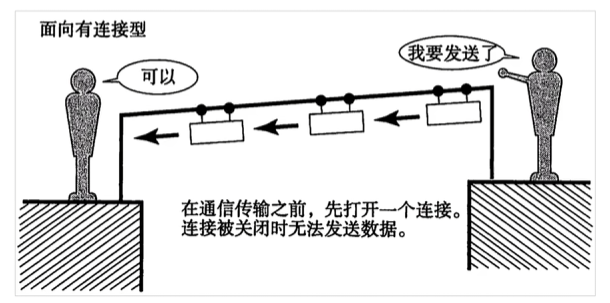

   

2. TCP通信步骤

   1. 创建连接
   2. 传输数据
   3. 关闭连接

   TCP通信模型相当于打电话，在通信开始之前，一定要先建立好连接，才能发送数据，通信结束要关闭连接

   

3. TCP特点 

   1. 面向连接

      通信双方必须先建立好连接才能进行数据传输，并且双方都会为此连接分配必要资源来记录连接的状态和信息。当数据传输完成后，双方必须断开此连接，以释放系统资源

   2. 可靠传输

      - TCP采用发送应答机制

        通过TCP这种方式发送的每个报文段都必须得到接收方的应答才认为这个TCP报文段传送成功

      - 超时传送

        发送端发送一个报文之后就会启动定时器，如果指定时间内没有得到应答就会重新发送这个报文段

      - 错误校验

        TCP用一个校验和函数来校验是否有错误，在发送和接收时都要计算校验和

      - 流量控制和阻塞管理

        流量控制用来避免发送端发送过快而使得接收方来不及接收

### 8、python3编码转换

网络数据传输：

​	网络传输是以二进制数据进行传输的

提示：

​	在网络传输数据的时候，数据需要先编码转化为二进制（bytes）数据类型

数据编码的转化：

​	

​	

| 函数名 | 说明                      |
| ------ | ------------------------- |
| encode | 编码 将字符串转化为字节码 |
| decode | 解码 将字节码转化为字符串 |

提示：encode和decode()函数可以接受参数，encoding是指在解码过程中使用的编码方案

bytes.decode(encoding="utf-8")

str.encode(encoding="utf-8")

### 8、TCP客户端程序开发流程

1. TCP网络应用程序开发分为：

   - TCP客户端程序开发
   - TCP服务端程序开发
   - 主动发起建立连接请求的是客户端程序
   - 等待接受连接请求的是服务端程序

2. TCP客户端程序开发流程介绍

   1. 创建客户端套接字对象（买电话）

   2. 和服务端套接字建立连接（打电话）

   3. 发送数据（说话）

   4. 接收数据（接听）

   5. 关闭客户端套接字（挂电话）

      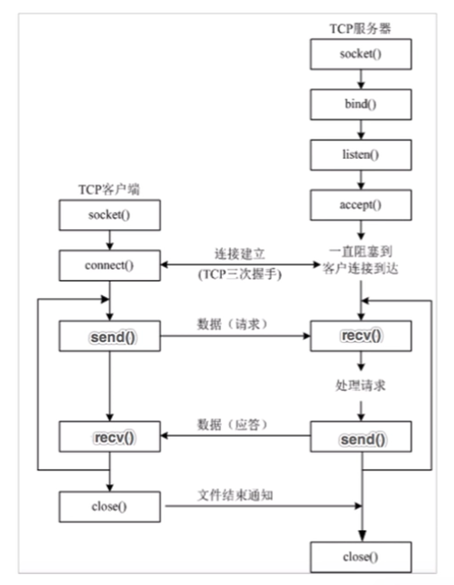

### 9、TCP客户端程序开发

1. 客户端程序开发步骤

   1. 创建客户端套接字对象（买电话）
   2. 和服务端套接字建立连接（打电话）
   3. 发送数据（说话）
   4. 接收数据（接听）
   5. 关闭客户端套接字（挂电话）

2. socket类的介绍

   1. 导入socket模块：

      import socket

   2. 创建客户端socket对象使用socket类：

      socket.socket(AddressFamily,Type)

      | 参数名        | 说明                       |
      | ------------- | -------------------------- |
      | AddressFamily | IP地址类型，分为IPV4和IPV6 |
      | Type          | 传输协议类型               |

3. 客户端开发使用到的函数

   | 方法名  | 说明                   |
   | ------- | ---------------------- |
   | connect | 和服务端套接字建立连接 |
   | send    | 发送数据               |
   | recv    | 接收数据               |
   | close   | 关闭连接               |

4. 要点

   1. 导入socket模块
   2. 创建TCP套接字  'socket'
      - 参数1：AF_INET，表示IPV4
      - 参数2：SOCK_STREAM，表示TCP传输协议类型
   3. 发送数据  'send'
      - 参数1：要发送的二进制数据，注意字符串需要使用encode()方法进行编码
   4. 接收数据  'recv'
      - 参数1：表示每次接收数据的大小，单位是字节
   5. 关闭套接字  'socket' 表示通信完成

~~~python
import socket

if __name__ == '__main__':
  # 1.创建客户端套接字对象
    # AF_INET:使用IPv4协议
    # SOCK_STREAM:使用TCP协议
  tcp_client_socket = socket.socket(socket.AF_INET,socket.SOCK_STREAM)

  # 2.和服务端套接字建立连接
  tcp_client_socket.connect(('192.168.19.1',8080))

  # 3.发送数据
  tcp_client_socket.send("Hello".encode(encoding='utf-8'))

  # 4.接收数据  recv阻塞等待数据的到来 单位是字节
  recv_data = tcp_client_socket.recv(1024)

  # 关闭客户端套接字
  tcp_client_socket.close()
  print(recv_data.decode('utf-8'))
~~~

### 10、TCP服务端程序开发流程

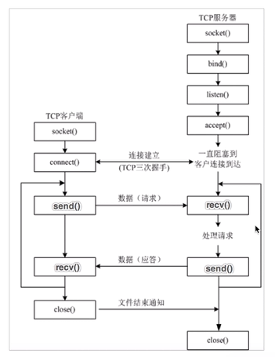

1. TCP服务端程序开发流程介绍
   1. 创建服务端套接字
   2. 绑定IP地址和端口号
   3. 设置监听
   4. 等待接受客户端的连接请求
   5. 接收数据
   6. 发送数据
   7. 关闭套接字

### 11、TCP服务端程序开发

1. TCP服务端程序开发流程介绍
   1. 创建服务端套接字
   2. 绑定IP地址和端口号
   3. 设置监听
   4. 等待接受客户端的连接请求
   5. 接收数据
   6. 发送数据
   7. 关闭套接字

   ~~~python
   import socket
   
   if __name__ == '__main__':
     # 1. 创建服务端套接字
     tcp_server_socket = socket.socket(socket.AF_INET, socket.SOCK_STREAM)
   
     # 2. 绑定IP地址和端口号
     # tcp_server_socket.bind(('192.168.19.1', 8080))
     # 如果bind中第一个参数为空字符串，则默认绑定本机IP地址
     tcp_server_socket.bind(('192.168.19.1', 8888))
   
     # 3. 设置监听 128：代表服务端等待排队连接的最大数量
     tcp_server_socket.listen(128)
   
     # 4. 等待接受客户端的连接请求 accept阻塞等待 返回一个用以和客户端通讯的socket，客户端的地址
     conn_socket, ip_port = tcp_server_socket.accept()
     print("客户端地址：",ip_port)
     # 5. 接收数据
     recv_data = conn_socket.recv(1024)
     print("接收到的数据：",recv_data.decode())
   
     # 6.发送数据
     send_data = "Hello, client!"
     conn_socket.send(send_data.encode())
   
     # 7. 关闭套接字
     conn_socket.close()
     tcp_server_socket.close()
   ~~~

   1. 导入socket模块
   2. 创建TCP套接字  "socket"
      - 参数1："AF_INET"，表示IPV4地址类型
      - 参数2："SOCK_STREAM"，表示TCP传输协议类型
   3. 绑定端口号  "bind"
      - 参数1：元组，比如:（'',端口号），元组里面的一个元素是ip地址，一般不需要设置，第二个元素是启动程序后使用的端口号。
   4. 设置监听  "listen"
      - 参数1：最大等待连接数
   5. 等待接受客户端的连接请求  "accept"
   6. 发送数据  "send"
      - 参数1：要发送的二进制数据，注意：字符串需要使用encode()方法进行解码
   7. 接收数据  "recv"
      - 参数1：表示每次接收数据的大小，单位是字节，注意：解码成字符串使用decode()方法
   8. 关闭套接字  "socket"表示通信完成

### 12、TCP网络应用程序注意点

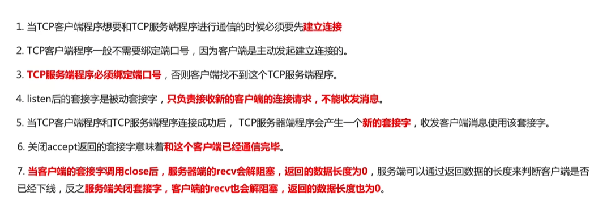

~~~python
  # 设置端口复用
  # 这三个参数分别是：SOL_SOCKET表示套接字选项（当前使用的socket进行设置），SO_REUSEADDR表示复用地址，参数值为1表示允许复用
  tcp_server_socket.setsockopt(socket.SOL_SOCKET, socket.SO_REUSEADDR, 1)
~~~

### 13、socket之send和recv原理剖析

1. TCP socket发送和接收缓冲区

   当创建一个TCP socket对象的时候会有一个发送缓冲区和一个接受缓冲区，这个发送和接收缓冲区指的就是内存中的一片空间

2. send原理剖析

   send是不是直接把数据发给服务端？

   不是，要想**发送数据**，**必须得通过网卡发送数据**，**应用程序无法直接通过网卡发送数据**，它需要**调用操作系统**接口，也就是说，**应用程序把发送的数据先写入到发送缓冲区（内存中一片空间）**，再**由操作系统控制网卡把发送缓冲区的数据发送给服务端网卡**

3. recv原理剖析

   recv是不是直接从客户端接受数据？

   不是，**应用软件无法直接通过网卡接收数据**，需要**调用操作系统接口**，由**操作系统通过网卡接收数据**，**把接收的数据写入到接收缓冲区（内存中一片空间）**，应用程序**再从接收缓冲区**获取客户端发送的数据

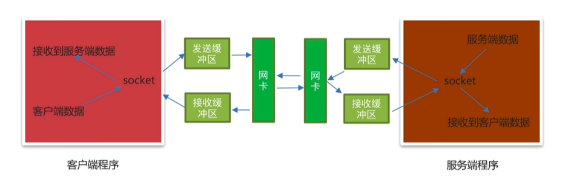

### 14、案例-多任务版TCP服务端程序开发

目前我们开发的TCP服务端程序只能服务于一个客户端

如何实现一个服务端服务多个客户端？

1. 实现步骤：
   1. 编写一个TCP服务端程序，循环等待客户端连接请求
   2. 使用多任务可以实现一个服务端同时服务多个客户端，本案例中使用线程

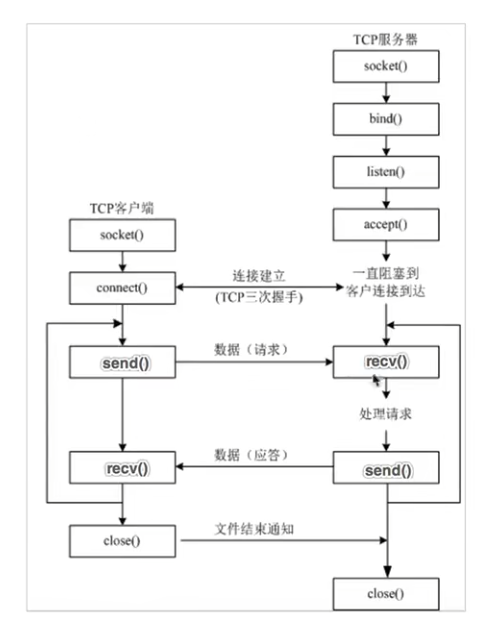

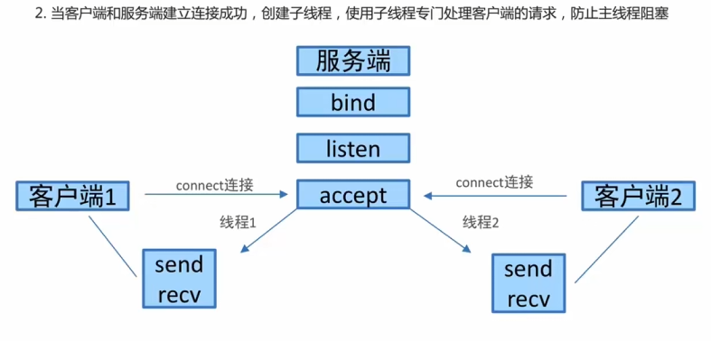

~~~python
import socket
import threading

def handle_client(conn_socket):
  # 处理客户端请求
  # 5. 接收数据
  recv_data = conn_socket.recv(1024)
  print("接收到的数据：",recv_data.decode())

  # 6.发送数据
  send_data = "Hello, client!"
  conn_socket.send(send_data.encode())

  # 7. 关闭套接字
  conn_socket.close()

if __name__ == '__main__':
  # 1. 创建服务端套接字
  tcp_server_socket = socket.socket(socket.AF_INET, socket.SOCK_STREAM)
  # 设置端口复用
  # 这三个参数分别是：SOL_SOCKET表示套接字选项（当前使用的socket进行设置），SO_REUSEADDR表示复用地址，参数值为1表示允许复用
  tcp_server_socket.setsockopt(socket.SOL_SOCKET, socket.SO_REUSEADDR, 1)

  # 2. 绑定IP地址和端口号
  # tcp_server_socket.bind(('192.168.19.1', 8080))
  # 如果bind中第一个参数为空字符串，则默认绑定本机IP地址
  tcp_server_socket.bind(('192.168.19.1', 8888))

  # 3. 设置监听 128：代表服务端等待排队连接的最大数量
  tcp_server_socket.listen(128)

  while True:
    # 4. 等待接受客户端的连接请求 accept阻塞等待 返回一个用以和客户端通讯的socket，客户端的地址
    conn_socket, ip_port = tcp_server_socket.accept()
    print("客户端地址：",ip_port)

    # 使用多线程去接收多个客户端请求
    sub_thread = threading.Thread(target=handle_client, args=(conn_socket,))
    sub_thread.start()

  # 负责接收连接
  tcp_server_socket.close()
~~~

知识要点：

1. 编写一个TCP服务端程序，循环等待接受客户端的连接请求
2. 当客户端和服务端建立连接成功，创建子线程，**使用子线程专门处理客户端的请求，防止主线程阻塞**

## Http等

### 1、网址

1. 网址的概念：

   网址又称url，意思是**统一资源定位符**，通俗理解就是网络资源地址

2. URL的组成

   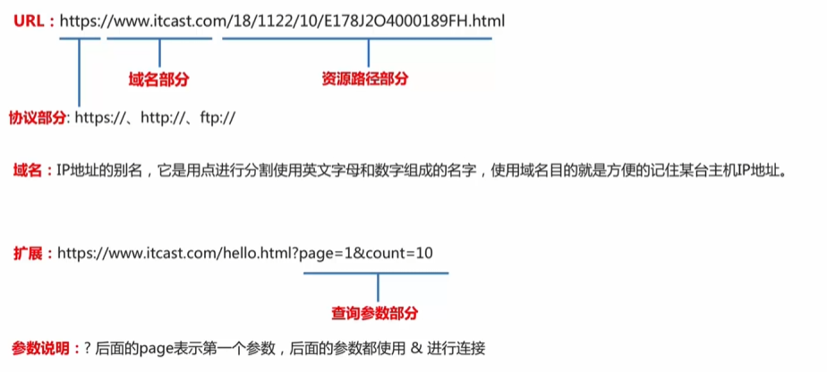

### 2、HTTP协议介绍

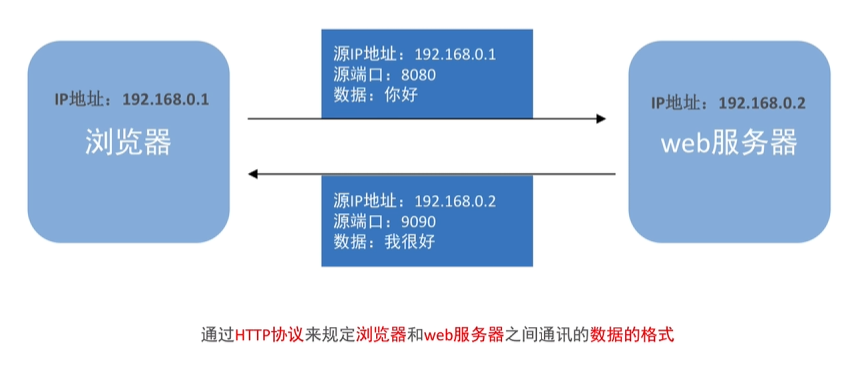

1. HTTP协议概念及作用

   HTTP协议：超文本传输协议

   超文本是指在**文本数据基础上还包含非文本数据**，非文本数据有**图片，音乐，视频**等，而这些非文本数据会使用**链接方式**进行加载显示，通俗来说超文本就是**带有链接的文本数据**也就是我们常说的**网页数据**

   

   HTTP协议设计之前目的是传输网页数据，现在**允许传输任意类型的数据**。

   传输HTTP协议格式的数据是基于**TCP传输协议**的，发送数据前需要先**建立连接**

   **TCP传输协议**是用来保证网络中传输的**数据安全性**，**HTTP协议**是用来规定这些数据的**具体格式**

2. 浏览器访问Web服务器的过程

   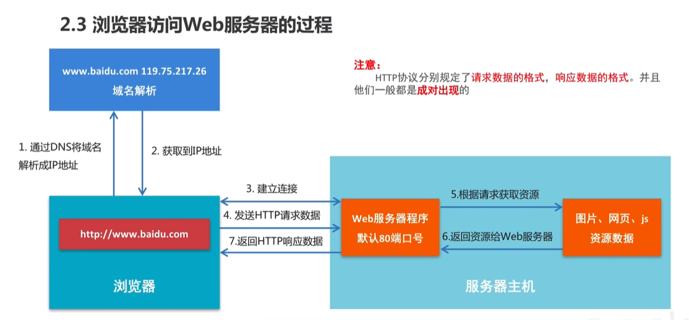

### 3、HTTP请求报文

1. GET方式请求报文

   获取web服务器数据

   - 请求行

     - 请求方式、请求资源路径、HTTP协议版本

   - 请求头

   - 空行

     Accept中：q是权值，越大越先显示

     

2. POST方式请求报文

   向web服务器发送数据

   - 请求行
     - 请求方式、请求资源路径、HTTP协议版本
   - 请求头
   - 空行
   - 请求体

   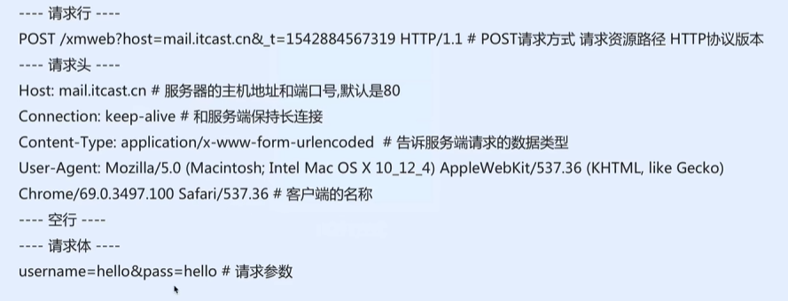

注意：**POST方式可以允许没有请求体**，但是很少见

### 4、HTTP响应报文

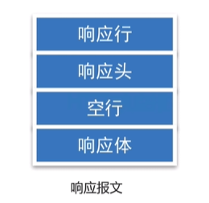

相应行由：HTTP协议版本、状态码、状态描述组成，最常见的状态码是200

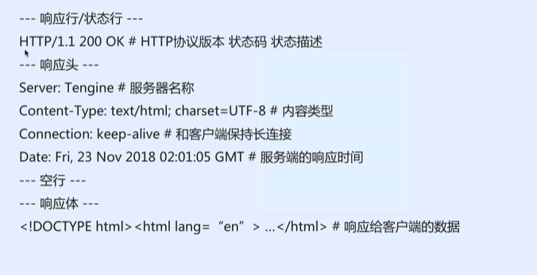

1. HTTP状态码介绍

   用于表示Web服务器响应状态的3位数字代码

   | 状态码 | 说明                             |
   | ------ | -------------------------------- |
   | 200    | 服务器已成功处理了请求           |
   | 400    | 错误的请求，请求地址或者参数有误 |
   | 404    | 请求资源在服务器不存在           |
   | 500    | 服务器内部源代码出现错误         |

### 5、查看HTTP协议的通信过程

1. 谷歌浏览器开发者工具使用

   略

2. 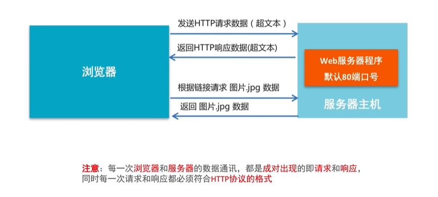

   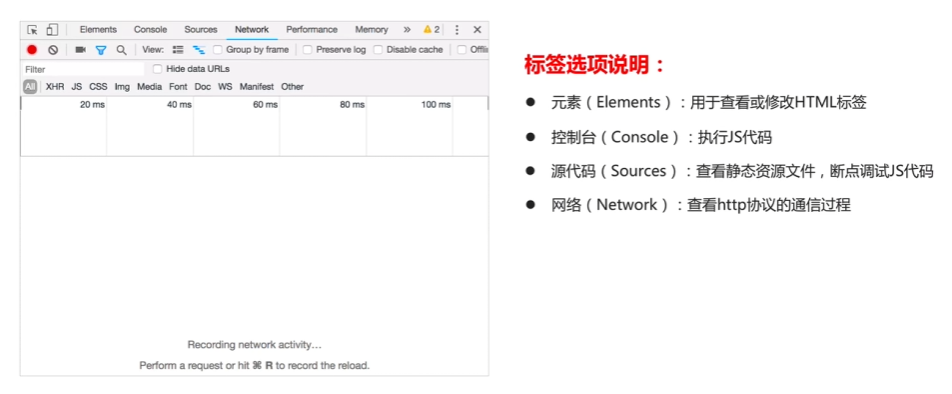

   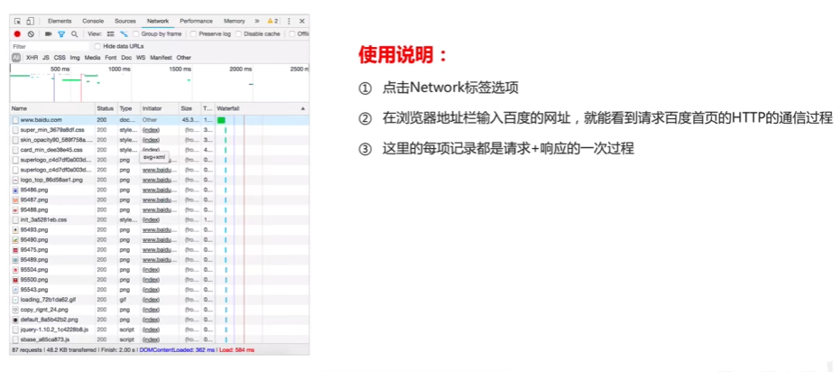

## Web

### 1、搭建Python自带的静态Web服务器

静态Web服务器是为发出请求的浏览器提供静态文档的程序，搭建python自带的服务器使用python -m http.server 端口号即可，默认端口号为8000

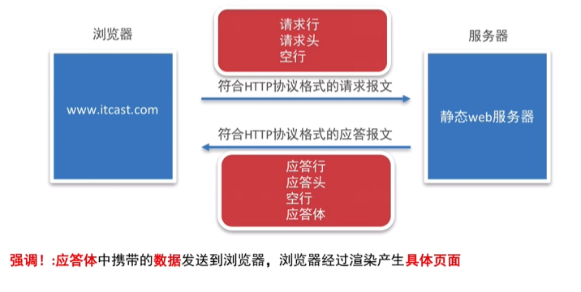

### 2、开发自己的静态Web服务器（返回固定页面数据）

开发步骤：

1. 编写一个TCP服务端程序

2. 获取浏览器发送的HTTP请求报文数据

3. 读取固定页面数据，把页面数据组装成HTTP响应报文数据发送给浏览器

4. HTTP响应报文数据发送完成以后，关闭服务于客户端的套接字

   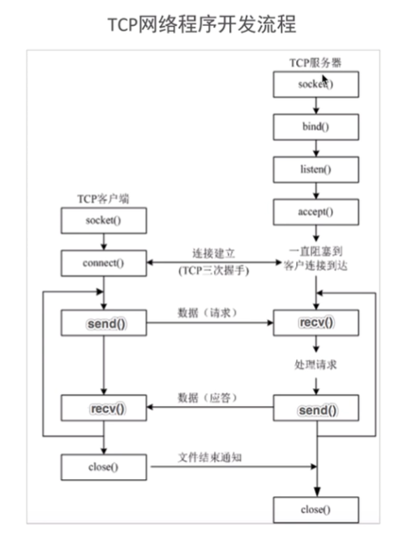

~~~python

import socket
import threading

if __name__ == '__main__':
  
# 1. 编写一个TCP服务端程序
  # 1.创建TCP服务端套接字
  tcp_socket_server = socket.socket(socket.AF_INET, socket.SOCK_STREAM)
  tcp_socket_server.setsockopt(socket.SOL_SOCKET,socket.SO_REUSEADDR,1)
  # 2.绑定IP地址和端口号
  tcp_socket_server.bind(('127.0.0.1', 8080))
  # 3.设置监听，等待客户端连接
  tcp_socket_server.listen(128)

  while True:
# 2. 获取浏览器发送的HTTP请求报文数据
    # 1.建立连接
    client_socket, client_addr = tcp_socket_server.accept()
    # 2.获取浏览器请求信息
    client_request_data = client_socket.recv(1024).decode()
    # 3.打印
    print(client_request_data)

# 3. 读取固定页面数据，把页面数据组装成HTTP响应报文数据发送给浏览器
    with open('learn\Python进阶\static\品优购项目\index.html', 'rb') as f:
      file_data = f.read()

    # 应答行
    response_line = 'HTTP/1.1 200 OK\r\n'
    # 应答头
    response_header = 'Server: Python\r\n'
    # 应答体
    response_body = file_data
    # 组装HTTP响应报文数据
    response_data = (response_line + response_header + '\r\n').encode() + response_body

    client_socket.send(response_data)
    
# 4. HTTP响应报文数据发送完成以后，关闭服务于客户端的套接字
    client_socket.close()
~~~

### 3、开发自己的静态Web服务器（返回指定页面数据）

步骤：

1. 获取用户请求资源路径
2. 根据请求资源的路径，读取指定文件的数据
3. 组装指定文件数据的响应报文，发送给浏览器
4. 判断请求文件在服务端不存在，组装404状态响应报文，发送给浏览器

~~~python
import socket
import threading

def solve_request(status_code,client_socket, client_addr, file_data):
  # 应答头
  response_header = 'Server: Python\r\n'
  if status_code == 200:
    # 应答行
    response_line = 'HTTP/1.1 200\r\n'
    # 应答体
    response_body = file_data
    # 组装HTTP响应报文数据
    response_data = (response_line + response_header + '\r\n').encode() + response_body

  elif status_code == 404:
    # 应答行
    response_line = 'HTTP/1.1 404 Not Found\r\n'
    # 应答体
    response_body = "404 Not Found"
    # 组装HTTP响应报文数据
    response_data = (response_line + response_header + '\r\n' + response_body).encode() 
  client_socket.send(response_data)

if __name__ == '__main__':
  
# 1. 编写一个TCP服务端程序
  # 1.创建TCP服务端套接字
  tcp_socket_server = socket.socket(socket.AF_INET, socket.SOCK_STREAM)
  tcp_socket_server.setsockopt(socket.SOL_SOCKET,socket.SO_REUSEADDR,1)
  # 2.绑定IP地址和端口号
  tcp_socket_server.bind(('127.0.0.1', 8080))
  # 3.设置监听，等待客户端连接
  tcp_socket_server.listen(128)

  while True:
# 2. 获取浏览器发送的HTTP请求报文数据
    # 1.建立连接
    client_socket, client_addr = tcp_socket_server.accept()
    # 2.获取浏览器请求信息
    client_request_data = client_socket.recv(1024).decode()
    # 3.打印
    print(client_request_data)
    # 4.获取用户请求资源路径
    request_data = client_request_data.split()
    print(request_data)
    request_path = request_data[1]

    if request_path == "/":
        request_path = "/index.html"

# 3. 读取固定页面数据，把页面数据组装成HTTP响应报文数据发送给浏览器
    try:
      with open(f'learn\Python进阶\static\品优购项目\{request_path}', 'rb') as f:
        file_data = f.read()
    except Exception as e:
      solve_request(404, client_socket, client_addr, file_data)
    else:
      solve_request(200, client_socket, client_addr, file_data)
    
    finally:
# 4. HTTP响应报文数据发送完成以后，关闭服务于客户端的套接字
      client_socket.close()
~~~

### 4、发开自己静态Web服务器（多任务版）

~~~python
import socket
import threading

def solve_request(status_code,client_socket, client_addr, file_data):
  # 应答头
  response_header = 'Server: Python\r\n'
  if status_code == 200:
    # 应答行
    response_line = 'HTTP/1.1 200\r\n'
    # 应答体
    response_body = file_data
    # 组装HTTP响应报文数据
    response_data = (response_line + response_header + '\r\n').encode() + response_body

  elif status_code == 404:
    # 应答行
    response_line = 'HTTP/1.1 404 Not Found\r\n'
    # 应答体
    response_body = "404 Not Found"
    # 组装HTTP响应报文数据
    response_data = (response_line + response_header + '\r\n' + response_body).encode() 
  client_socket.send(response_data)

def handle_client(client_socket):
# 2.获取浏览器请求信息
  client_request_data = client_socket.recv(1024).decode()
  # 3.打印
  print(client_request_data)
  
  # 4.获取用户请求资源路径
  request_data = client_request_data.split()

  # 判断客户端是否关闭
  if len(request_data)==1:
    client_socket.close()
    return
  print(request_data)
  request_path = request_data[1]
  if request_path == "/":
      request_path = "/index.html"

# 3. 读取固定页面数据，把页面数据组装成HTTP响应报文数据发送给浏览器
  try:
    with open(f'learn\Python进阶\static\品优购项目\{request_path}', 'rb') as f:
      file_data = f.read()
  except Exception as e:
    solve_request(404, client_socket, client_addr, None)
  else:
    solve_request(200, client_socket, client_addr, file_data)
    
  finally:
# 4. HTTP响应报文数据发送完成以后，关闭服务于客户端的套接字
    client_socket.close()

if __name__ == '__main__':
  
# 1. 编写一个TCP服务端程序
  # 1.创建TCP服务端套接字
  tcp_socket_server = socket.socket(socket.AF_INET, socket.SOCK_STREAM)
  tcp_socket_server.setsockopt(socket.SOL_SOCKET,socket.SO_REUSEADDR,1)
  # 2.绑定IP地址和端口号
  tcp_socket_server.bind(('127.0.0.1', 8080))
  # 3.设置监听，等待客户端连接
  tcp_socket_server.listen(128)

  while True:
    
# 2. 获取浏览器发送的HTTP请求报文数据
    # 1.建立连接
    client_socket, client_addr = tcp_socket_server.accept()
    sub_thread = threading.Thread(target=handle_client,args=(client_socket,))
    sub_thread.start()

  # 3. 关闭服务端套接字
  tcp_socket_server.close()
~~~

### 5、静态Web服务器-面向对象开发

步骤：

1. 把提供服务的Web服务器抽象成一个类（HTTPWebServer）
2. 提供Web服务器初始化方法，在初始化方法里面创建Socket对象
3. 提供一个开启Web服务器的方法，让Web服务器处理客户端请求操作

~~~python
import socket
import threading
  # # 3. 关闭服务端套接字
  # tcp_socket_server.close()

class HttpWebServer:
  def __init__(self) -> None:
  # 1. 编写一个TCP服务端程序
    # 1.创建TCP服务端套接字
    self.tcp_socket_server = socket.socket(socket.AF_INET, socket.SOCK_STREAM)
    self.tcp_socket_server.setsockopt(socket.SOL_SOCKET,socket.SO_REUSEADDR,1)
    # 2.绑定IP地址和端口号
    self.tcp_socket_server.bind(('127.0.0.1', 8080))
    # 3.设置监听，等待客户端连接
    self.tcp_socket_server.listen(128)
    pass

  def solve_request(self,status_code,client_socket, client_addr, file_data):
  # 应答头
    response_header = 'Server: Python\r\n'
    if status_code == 200:
      # 应答行
      response_line = 'HTTP/1.1 200\r\n'
      # 应答体
      response_body = file_data
      # 组装HTTP响应报文数据
      response_data = (response_line + response_header + '\r\n').encode() + response_body

    elif status_code == 404:
      # 应答行
      response_line = 'HTTP/1.1 404 Not Found\r\n'
      # 应答体
      response_body = "404 Not Found"
      # 组装HTTP响应报文数据
      response_data = (response_line + response_header + '\r\n' + response_body).encode() 
    client_socket.send(response_data)

  def handle_client(self,client_socket, client_addr):
  # 2.获取浏览器请求信息
    client_request_data = client_socket.recv(1024).decode()
    # 3.打印
    print(client_request_data)
    
    # 4.获取用户请求资源路径
    request_data = client_request_data.split()

    # 判断客户端是否关闭
    if len(request_data)==1:
      client_socket.close()
      return
    print(request_data)
    request_path = request_data[1]
    if request_path == "/":
        request_path = "/index.html"

  # 3. 读取固定页面数据，把页面数据组装成HTTP响应报文数据发送给浏览器
    try:
      with open(f'learn\Python进阶\static\品优购项目\{request_path}', 'rb') as f:
        file_data = f.read()
    except Exception as e:
      self.solve_request(404, client_socket, client_addr, None)
    else:
      self.solve_request(200, client_socket, client_addr, file_data)
      
    finally:
  # 4. HTTP响应报文数据发送完成以后，关闭服务于客户端的套接字
      client_socket.close()

  def start(self):
    while True:
# 2. 获取浏览器发送的HTTP请求报文数据
    # 1.建立连接
      client_socket, client_addr = self.tcp_socket_server.accept()
      sub_thread = threading.Thread(target=self.handle_client,args=(client_socket,client_addr,))
      sub_thread.start()

if __name__ == '__main__':
  # 创建服务器对象
  my_web_server = HttpWebServer()
  # 启动服务器
  my_web_server.start()
~~~

### 6、静态Web服务器-命令行启动动态绑定端口号

1. 获取终端命令行参数动态绑定端口号的web服务器程序

   步骤：

   1. 获取执行pyhton程序的终端命令行参数
   2. 判断参数类型，设置端口号必须是整形
   3. 给Web服务器类初始化方法添加一个端口号参数，用于绑定端口号

## 数据库

### 1、什么是数据库

数据库本身是一种文件

数据库相比普通文件有以下特点：

- 持久化存储
- 读写速度极高
- 保证数据有效性
- 对程序支持性非常好，容易扩展

### 2、数据库分类

- 关系型数据库：MySQL
  - 指采用了关系模型来组织数据的数据库，关系模型指的就是二维表格模型
  - MySQL采用双授权政策，分为社区办和商业版，由于体积小、速度快、总体使用成本低，开源，一般中小型网站使用MySQL
  - 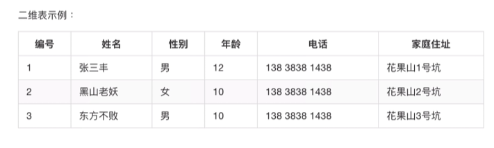
- 非关系型数据库：MangoDB、redis
  - NoSQL，强调Key-Value方式

### 3、数据库管理系统

1. 数据库管理系统介绍：

   是为管理数据库而设计的软件系统

   - 数据库文件集合：主要是一系列数据文件，作用存储数据

   - 数据库服务器：主要负责对数据文件以及文件中的数据进行管理

   - 数据库客户端：主要负责和服务端通信，向服务端传输数据或者从服务端获取数据

     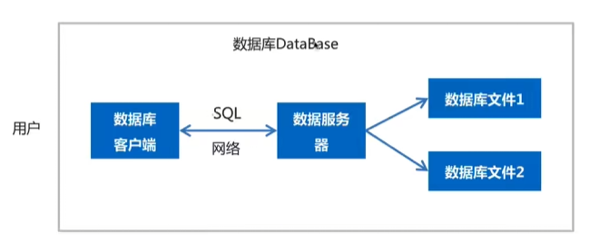

2. SQL语句：

   数据库客户端通过SQL语句告诉服务端

   SQL语句是结构化查询语言，是一种用来操作RDBMS的数据库语言。当前几乎所有关系型数据库都支持使用SQL语言操作，就是说可以通过SQL操作oracle、sql、server、mysql、sqlite等所有关系型数据库

   

   RDBMS是关系型数据库管理系统，专门管理关系型数据库

   

   常见的关系型数据库：

   - oracle：银行，电信等
   - ms sql server：在微软项目
   - sqlite：轻量型数据库，主要应用在移动平台
   - mysql：web时代使用最广泛的关系型数据库

### 4、Linux下MySQL环境

服务端：

1. 安装服务器端：
   - sudo apt-get install mysql-server
2. 启动服务：
   - sudo service mysql start
3. 查看进程中是否存在MySQL服务：
   - ps ajx|grep mysql
   - ps:查看当前系统进程  -a 系那是所有用户进程 -j任务格式显示进程 -x显示无控制终端进程
4. 关闭服务端
   - sudo server mysql stop

客户端：

1. 客户端安装：
   - sudo apt-get install mysql-client
2. 连接命令
   - mysql -uroot -pmysql
3. 退出连接
   - exit

### 5、mysq数据类型  略

### 6、数据完整性和约束

1. 数据完整性

   1. 数据完整性用于保证数据正确性，系统在更新、插入或者删除等要检查数据完整性，核实约束条件

2. 参照完整性

   1. 参照完整性属于表间规则。在更新、插入或者删除记录时，如果只改其一，就会影响数据完整性，如**删除表2的某记录，表1相应记录未删除**，则这些记录成为孤立记录

3. 约束

   | 约束类型    | 约束说明                     |
   | ----------- | ---------------------------- |
   | NOT NULL    | 非空                         |
   | PRIMARY KEY | 主键（唯一、非空）           |
   | UNIQUE KEY  | 唯一                         |
   | DEFAULT     | 默认约束（该数据的默认值）   |
   | FOREIGN KEY | 外键约束（需建立两表间关系） |

## 数据库命令

### 1、登录和退出数据库

1. 连接数据库
2. 输入用户名、密码
3. 完成对数据库的操作
4. 完成对表结构和表数据的操作
5. 退出数据库

| 快捷键      | 作用         |
| ----------- | ------------ |
| ctrl+a      | 快速回到行首 |
| ctrl+e      | 回到行末     |
| ctrl+l      | 清屏         |
| ctrl+c+回车 | 结束         |

| 命令                  | 作用                                                         |
| --------------------- | ------------------------------------------------------------ |
| mysql -u用户名 -p密码 | 连接数据库 不显示的输入密码：mysql -uroot -p （回车）密码 |
| exit / quit / ctrl+d  | 退出数据库                                                   |
| select version()      | 查看版本信息                                                 |
| select now()          | 查看时间                                                     |
| source 文件名         | 从sql文件中导入数据                                          |

### 2、数据库基本操作命令

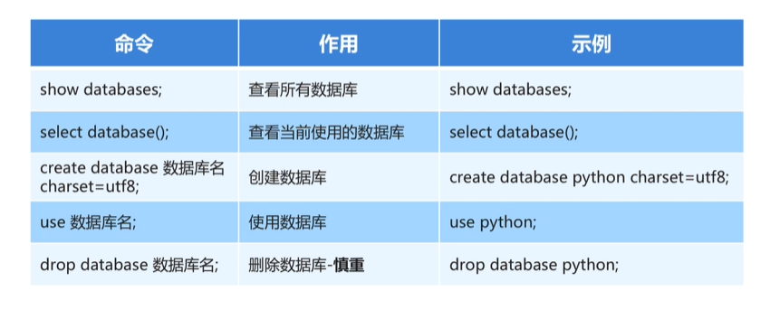

### 3、数据表基本操作命令

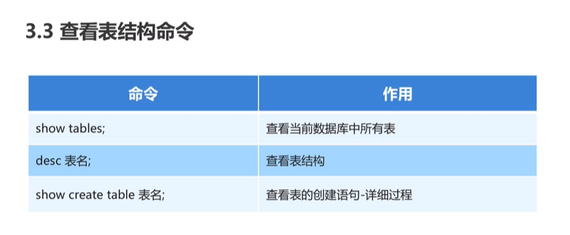

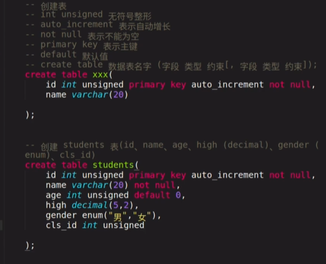

### 4、数据表结构修改命令

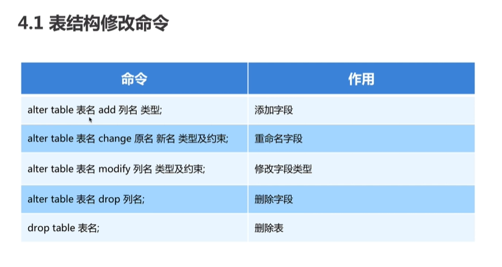

### 5、表数据操作命令

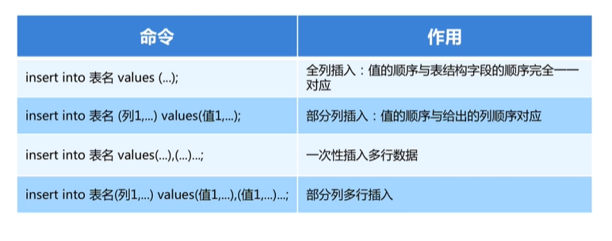

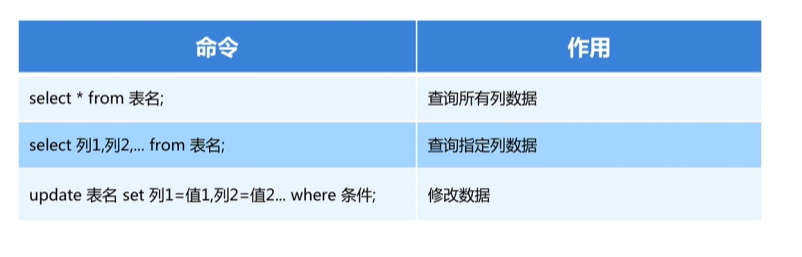

as：起别名

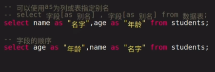

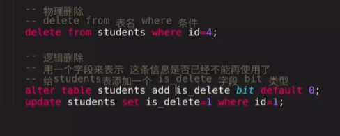

## 数据库查询语句

### 1、where比较运算查询

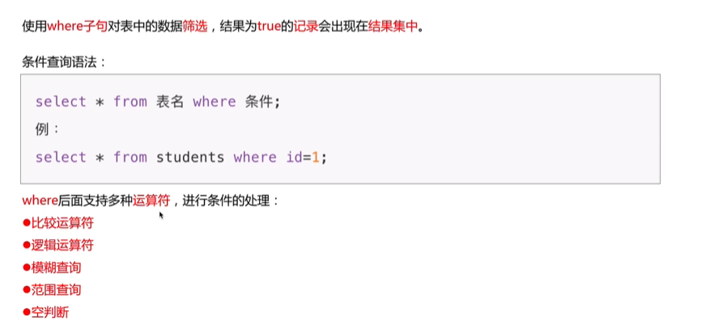

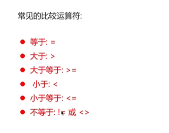

### 2、where逻辑运算查询

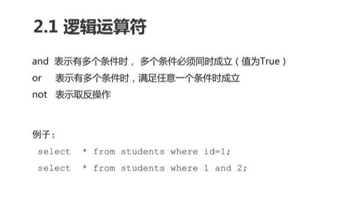

### 3、where模糊查询

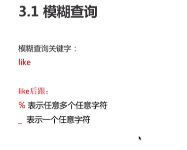

### 4、where范围查询

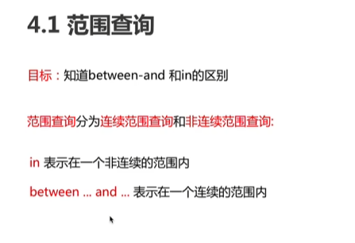

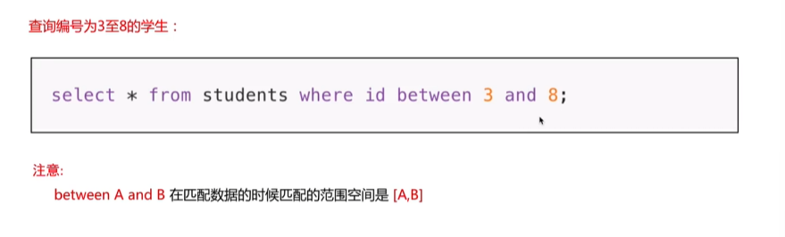

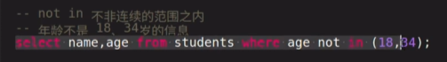

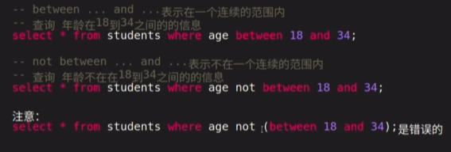

### 5、where空值判断

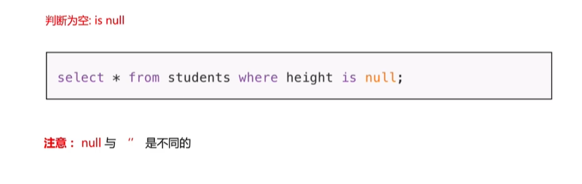

### 6、order排序查询

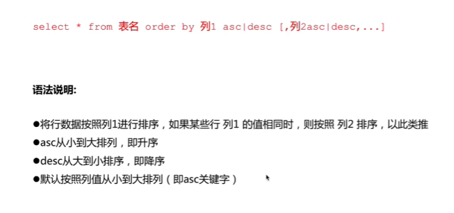

### 7、聚合函数

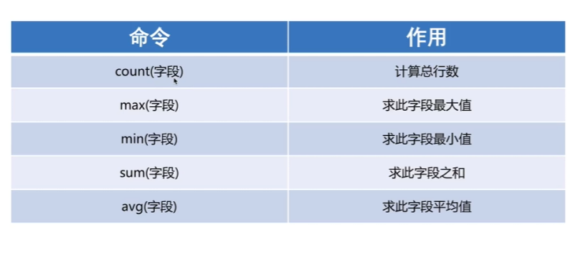

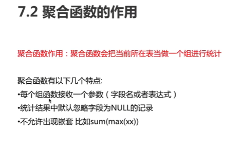

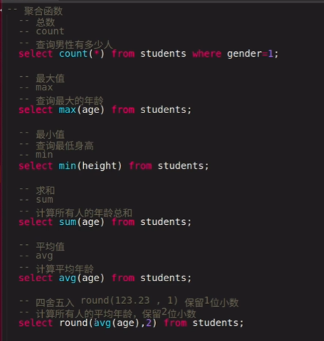

### 8、group分组查询

1. 按性别分组，查询所有性别

   - select gender from students group by gender;	# 注：根据什么分组就只能查询什么

2. 计算每种性别的人数

   - select gender,count(*) from students group by gender;	#注：聚合函数可用

3. group_contact(...)

   - select group_concat(name),gender from students group by gender;	#注：groupt_concat(...) 可以查询分组之外的

4. having

   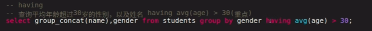

5. with rollup 汇总作用

   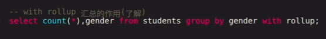

   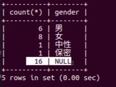

   最后一行即是汇总

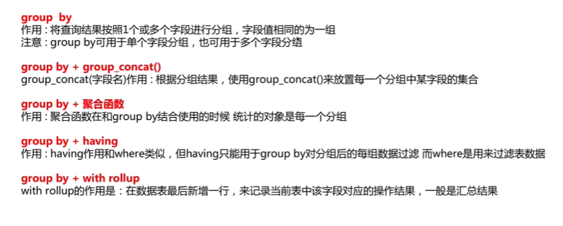

### 9、limit分页查询

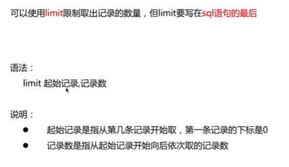

每页显示两个，显示第四页的信息，按年龄从小到大排序

select * from students order by age asc limit 6,2

### 10、连接查询

1. 内连接：

   根据连接条件取出两个表"交集";	on是连接条件，where是连接后筛选条件

   - 语法：select 字段 from 表1 inner join 表2 on 表1.字段1 = 表2.字段2

   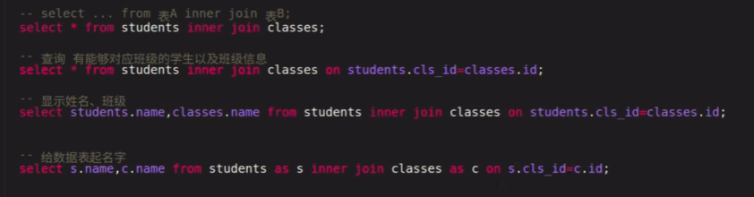

   

2. 外连接：

   左（外）连接查询：查询结果为两个表匹配到的数据和左表特有数据

   注意：对于右表中不存在的数据使用null填充（右连接相反）

   - 左连接语法：主表 left join 从表 on 连接条件
   - 右连接语法：从表 right join 主表 on 连接条件

   注意：

   - 能够使用连接的前提是。多表间有字段关联

   - 左右连接区别是在于主表在SQL语句中的位置，因此实际左连接就能满足常见需求

     

3. 自连接

   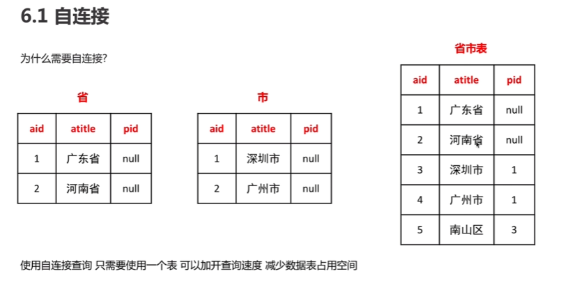

   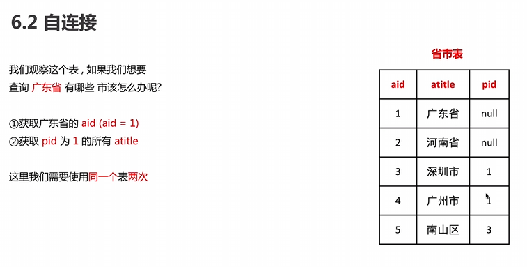

   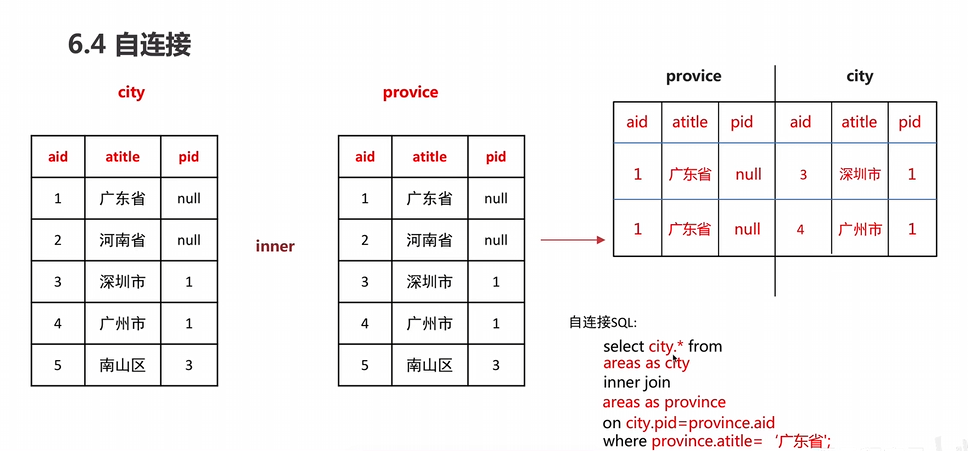

4. 子查询

   把一个查询结果当做另一个查询的条件

   子查询分三类：

   - 标量子查询：子查询返回的结果是一个数据（一行一列）
   - 列子查询：返回的结果是一列（一列多行）
   - 行子查询：返回的结果是一行（一行多列）
     1. ​	查询高于平均身高的信息（height）
        1. select avg(height) from students
        2. select * from students where height > (select avg(height) from students)
     2. 查询学生的班级号能够对应的学生名字
        1. select id from classes
        2. select name from students where cls_id in (select id from classes)

## MySQL进阶

### 1、MySQL实战操作

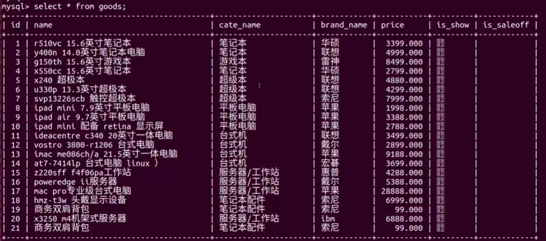

1. 查询类型cate_name 为'超极本' 的商品名称name、price（where）

   - select name,price from goods where cate_name='超极本'

2. 显示商品种类

   - select cate_name group by cate_name
   - select distint cate_name from goods (去重)

3. 求所有电脑产品平均值，并保留两位小数

   - select round(avg(price),2) from goods

4. 显示每种cate_name的平均价

   - select round(avg(price),2),cate_name from goods group by cate_name

5. 查询每种类型的商品中，最贵max、最便宜min、平均价avg、数量count

   - select cate_name max(price) min(price),avg(price),count(*) from goods group by cate_name

6. 查询所有价格大于平均价格的商品，并且按降价排序

   - select * from goods where price > (select avg(price) from goods) order by price desc

7. 查询每种类型中最贵的电脑信息

   - select **max(price) as max_price**,cate_name from goods  group by cate_name
   - select * from goods 
     inner join 
     (select **max(price) as max_price**,cate_name from goods  group by cate_name) as max_price_goods
     on goods.cate_name=max_price_goods.cate_name and goods.price=max_price_goods.max_price

   

1. 删除异常

   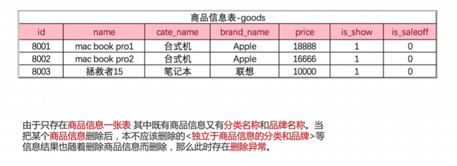

2. 信息表优化

   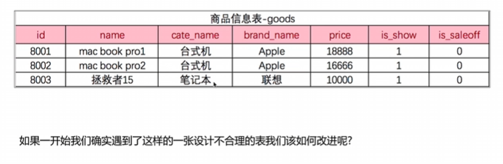

   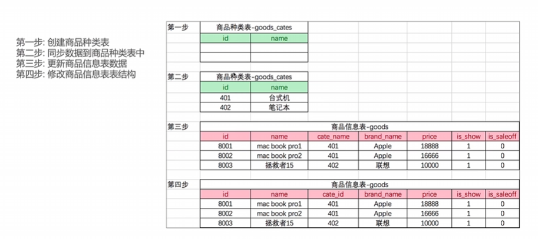

   1. 创建表

      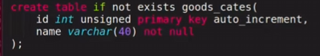

   2. 同步商品分类表 数据，将商品所有（种类信息）写入到（商品种类表）中

      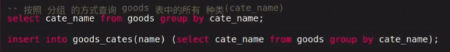

   3. 同步商品表 数据 通过goods_cates 数据表来更新goods

      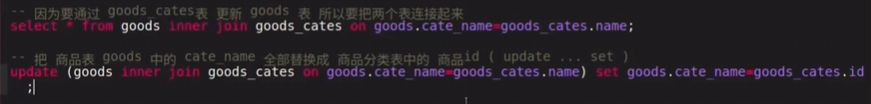

   4. 修改表结构

      

### 2、外键使用

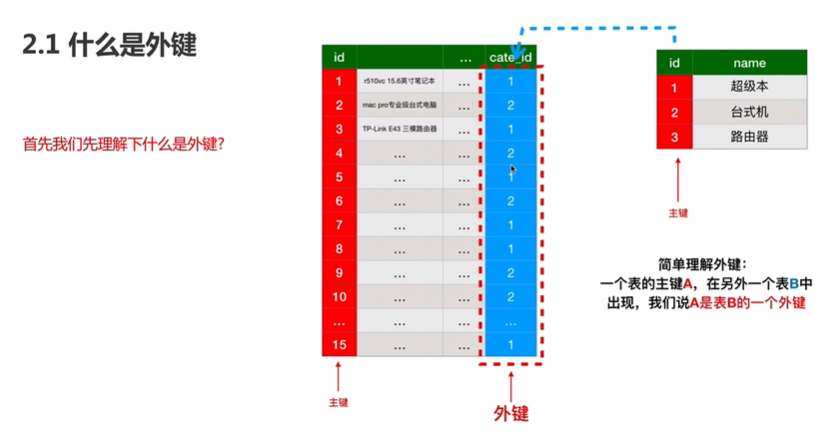

外键：限制约束无效数据，防止无效信息插入（但是添加多了会降低效率）

语法：**alter table** goods add **foreign key**(cate_id) **references** goods_cates(id);

取消语法：

- 首先获取外键约束名称，该名称系统会自动生成，可以通过查看表创还能语句来获取名称
  - show create table goods
- 获取名称之后就可以根据名称来删除外键约束
  - alter table goods drop foreign key goods_ibfk_1;

### 3、视图

视图概念，什么是视图

视图就是一个能把复杂SQL语句功能封装起来的一个虚表，所以在创建视图时，主要工作就在创建这条SQL查询的语句上。视图是对若干张表的引用，一张虚表，不存储具体的数据（基本表数据发生了改变，视图也会跟着改变）

视图的好处：方便操作，特别是查询操作，减少复杂的SQL语句，增强可用性，复用性；

视图的使用

- 定义视图

  - create view 视图名称 as select 语句

- 查看视图

  - show tables

- 使用视图

  - select * from v_goods_info

- 删除视图

  - drop view 视图名称

    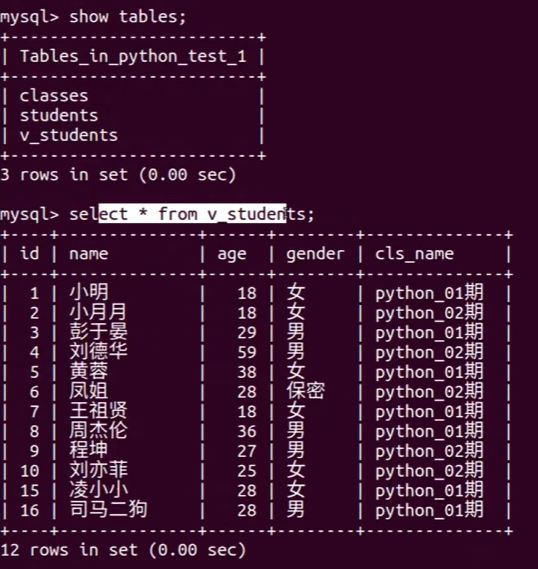

    

    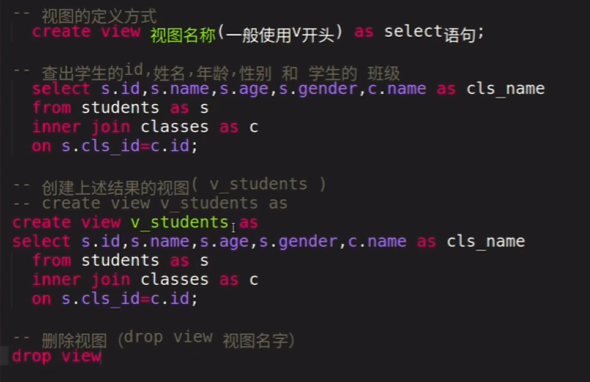

### 4、事务

1. 事务的概念及特点

   要**完成**的一件事情

   为什么要有事务：有时完成一个功能，需要执行多个SQL语句，如果这些SQL执行到一半突然停电了，那么就会导致这个功能只完成了一半，这种情况不允许出现

   事务Transaction：指作为一个基本工作单元执行的一系列SQL与居家操作，要么完全执行，要么完全不执行

   四大特性：

   - 原子性
     - 一个事务必须被视为一个不可分割的最小工作单元，整个事务中的所有操作要么全部提交成功，要么全部失败回滚，对于一个事务来说，不可能只执行其中一部分操作，这就是事务的原子性
   - 一致性
     - 数据库总是从一个一致性的状态转换到另一个一致性的状态。（一致性确保了即使在执行一些语句时系统崩溃，事务没有提交也不会将修改保存到数据库中）
     - 两个事务会排队等待
   - 隔离性
     - 通常来说，一个事务所做的修改在最终提交以前，对其他事物是不可见的
   - 持久性
     - 一旦事务提交，所做修改将会永久保存到数据库，即便此时系统崩溃，修改的数据也不会丢失

   事务SQL的样本如下

   1. start transaction;
   2. select.....;
   3. update.....;
   4. commit;

2. 事务的使用

   1. 开启事务：开启事务后执行修改命令，变更会维护到本地缓存中，而不维护到物理表中
      1. begin / start transaction
   2. 提交事务：将缓存中的数据变更维护到物理表中
      1. commit
   3. 回滚事务：放弃缓存中的变更数据，表示事务执行失败，回到开始事务前的状态
      1. rollback

   

   

### 5、索引

概念：如果数据库本身是一个字典，那么索引就是这个字典的目录

本质：是一种特殊文件，包含对数据表里所有记录的信息

索引使用：

1. 查看表中已有索引

   - show index from 表名

2. 创建索引

   - alter table 表名 add index 索引名【可选】（字段名，、、、）

3. 删除索引

   - drop index 索引名称 on 表名

   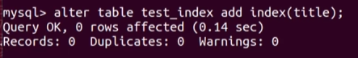

   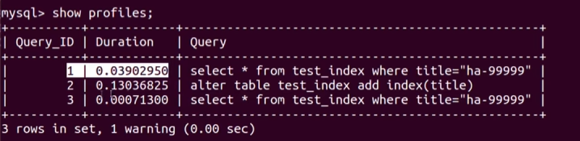

   

   

### 6、数据库设计三范式

1. 什么是三范式？

   设计关系数据库时，遵从不同规范要求，设计出合理关系型数据库，这些不同规范要求被称为不同范式，各种范式呈递次规范，越高的范式**数据库冗余**越小

   

2. 范式划分：

   数据冗余是指数据之间重复，也可以说是同意数据存储在不同数据文件中的现象

   六种范式：

   - 第一范式（1NF）
     - 强调字段原子性，即一个字段不能再分成其他几个字段
     - 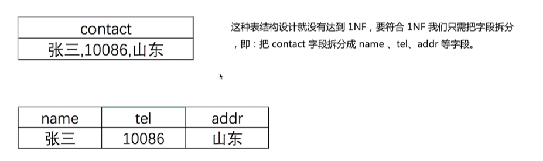
   - 第二范式（2NF）
     - 满足1NF基础上，另外包含两部分内容
       1. 表必须有一个主键 
       2. 非主键字段必须完全依赖于主键，而不能只依赖于主键的一部分
       3. 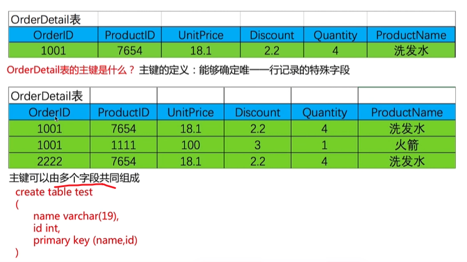
   - 第三范式（3NF）
     - 满足2NF，另外非主键字段必须直接依赖于主键，不能存在传递依赖，即不能存在，非主键字段A依赖于非主键字段B，非主键字段B依赖于主键的情况
     - 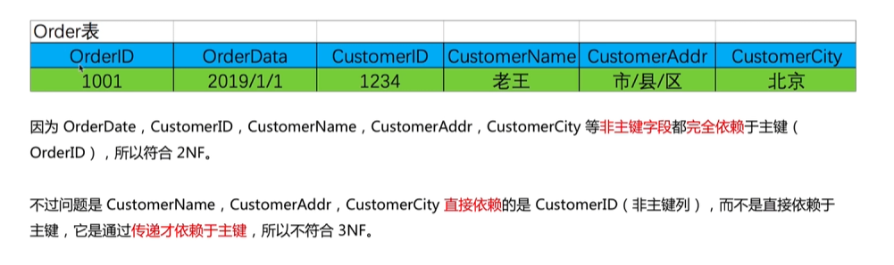
     - 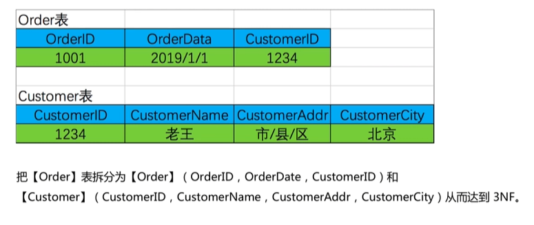
   - 巴斯-科德范式（BCNF）
   - 第四范式（1NF）
   - 第五范式（1NF）

   一般遵循前三种范式即可

### 7、E-R模型及表间关系

E-R模型使用场景：

1. 大型公司开发项目，需要先根据产品经理的设计，先使用建模工具，如power designer，db desinger等来画出**实体-关系**模型（E-R模型）
2. 然后根据**三范式**设计数据库表结构
3. 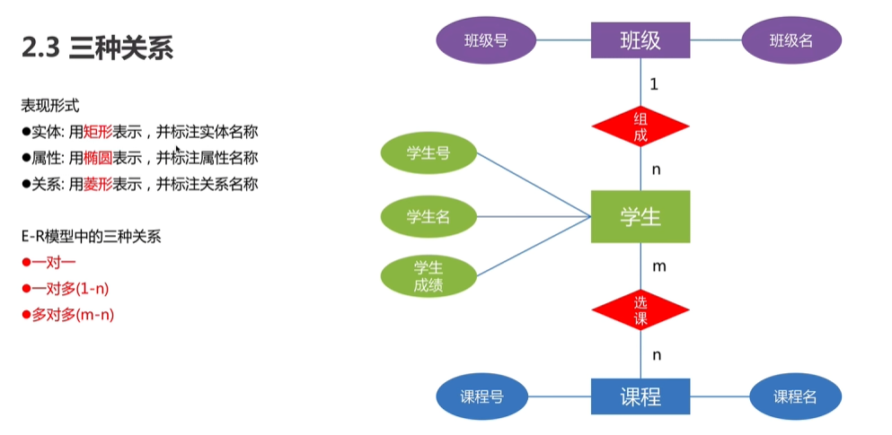

### 8、Python连接数据库

pymysql使用步骤：

1. 导入pymysql

   1. import pymysql

2. 创建连接对象（建立连接，桥梁）

   1. 调用pymysql模块中的connect()函数来创建连接对象，conn=connect(参数列表)
      - 参数host：连接的mysql主机，本机则为localhost
      - 参数port：连接的mysql主机端口，默认3306
      - 参数user：连接的用户名
      - 参数password：连接密码
      - 参数database：数据库名称
      - 参数charset：通信采用的编码方式
   2. 连接对象conn的操作
      - 关闭连接conn.close()
      - 提交数据conn.commit()
      - 撤销数据conn.rollback()

3. 获取游标对象（搬运小弟）

   1. 获取游标对象目标是执行sql语句，完成对增删改查的操作

      1. 调用连接对象cursor()方法
      2. 获取游标对象cur=**conn.cursor()**

   2. 游标操作说明：

      1. 使用游标执行SQL语句：execute(operation[parameters])执行SQL语句，返回受影响的行数，主要用于执行insert、update、delete、select等

      2. 获取查询结果集中的一条数据：cur.fechone()返回一个元组，如（1，'张三'）

      3. 获取查询结果集中的所有数据：cur.fetchall()返回一个元组，如（（1，'张三'），（2，'李四'））

      4. 关闭游标：cur.colse(),表示合数据库操作完成

         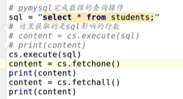

         

4. pymysql完成数据增删改查

   1. 增删改查sql语句
   2. sql=select * from 数据表
   3. 执行sql语句
      - cursor.execute(sql)
   4. conn.commit()

5. 关闭游标和连接

   1. 先关闭游标：cur.clouse()
   2. 后关闭连接：conn.close()

### 9、SQL语句参数化

1. SQL注入：

   用户提交带有恶意的数据与SQL语句进行字符串方式进行拼接，从而影响了SQL语句语义，最终产生数据泄露

   ~~~python
   # SQL注入案例
   import pymysql
   # 创建连接对象
   conn = pymysql.connect(host="localhost",port=3306,user="root",database="students",charset="uft-8")
   # 获取游标对象
   cur = conn.cursor()
   
   # 不安全的方式
   # 根据id查询学生信息
   find_name = input("请输入需要查询的学生姓名：")
   
   # 当find_name 为 'or 1 or'
   # "select * from students where name='' or 1 or ''"  永真
   sql = "select * from students where name='%s'" % find_name
   
   # 显示所有数据
   cur.execute(sql)
   content = cs.fetchall()
   for i in content:
       print(i)
       
   #关闭连接
   cur.close()
   conn.close()
   ~~~

2. SQL语句参数化：

   - SQL语言中参数使用%s占位，此处不是python中字符串格式化操作
   - 将SQL语句中%s占位所需要的参数存放在一个列表中，把参数列表传递给execute()方法的第二个参数

3. 安全的方式：

   ~~~python
   # 构造参数列表
   parms = [find_name]
   # 执行select语句
   sql = "select * from goods where name=%s"
   cur.execute(sql,params)
   ~~~

   

## 闭包

### 1、函数参数

~~~python
def fun01():
    print("func01 is show")
    
# func01()
# 函数名存放的是函数所在空间的地址
print(func01)
# 函数名也可以像普通变量一样赋值
func02 = func01
func02()  #输出func01 is show
~~~

函数名作用：

- 函数名存放的是函数所在空间的地址
- 函数名()执行函数名所存放空间地址中的代码
- func01 = func02函数名可以像普通变量一样赋值，func01()等价于func02()
- 结论：函数可以像普通变量一样作为参数使用

### 2、闭包

1. 闭包使用场景

   当函数调用完，函数内定义的变量都销毁了，但是有时候需要保存函数内变量，每次在这个变量上完成一系列操作，比如：每次在变量基础上和其他数字进行求和

   上述就能通过闭包解决

2. 闭包作用：可以保存函数内的变量，不会随着函数调用完销毁

3. 闭包定义：

   在函数嵌套的前提下，内部函数使用了外部函数的变量，并且外部函数返回了内部函数，我们把这个使用外部函数变量的内部函数称为闭包

4. 闭包构成的条件：

   1. 在函数嵌套（函数中定义函数的前提下）
   2. 内部函数使用了外部函数的变量（还包括外部函数的参数）
   3. 外部函数返回了内部函数
   
   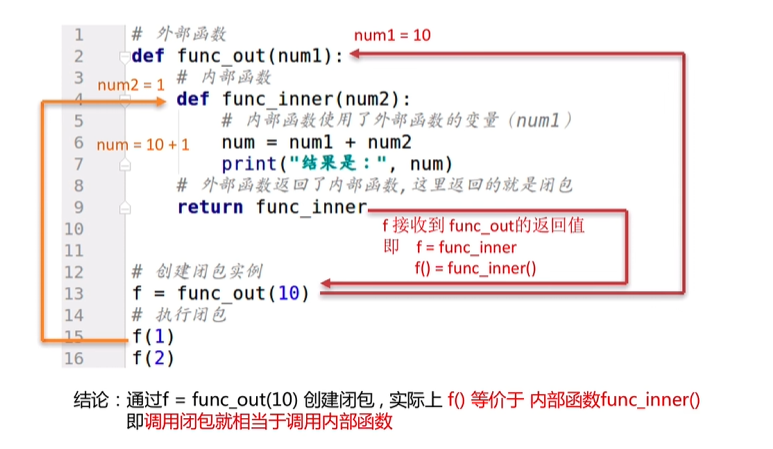
   
   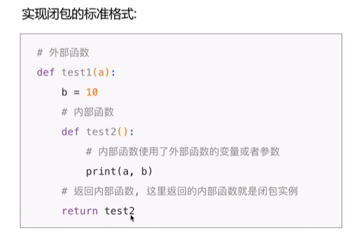
   
   ~~~python
   # 闭包的构成条件
   def func_out(num1):
       def func_inner(num2):
           num = num1+num2
       return func_inner
   
   # 创建闭包实例
   f = func_out(10)
   # 执行闭包
   f(1)
   f(2)
   
   # 输出结果  11、12
   ~~~
   
   ~~~python
   def talk(name):
     def say_info(info):
       print(name+":Hello, %s" % info)
     return say_info
   
   
   f = talk("张三")
   f("你好")
   f("我是张三")
   
   f = talk("李四")
   f("你好")
   f("我是李四")
   ~~~

结论：闭包可以对外部函数变量进行保存

闭包内修改外部变量：

~~~python
def func_out(num1):
  def func_inner(num2):
    # 声明外部变量
    nonlocal num1
    num1 = num2+10
    print(f"inner:{num1}")
  # 加func_inner 是30
  func_inner(20)

  print(num1)
  return func_inner

f = func_out(10)
f(num2=20)
~~~

## 装饰器

### 1、装饰器概念

装饰器符合了 开发中的封闭开放原则

1. 装饰器作用：

   ​	在不改变原有函数的源代码的情况下，给函数增加新功能

2. 装饰器功能特点：

   1. 不修改已有函数的源代码
   2. 给已有函数增加额外功能

3. 装饰器使用：

   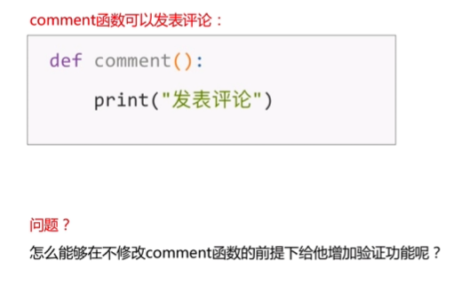

   使用步骤：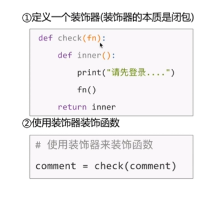
   
   个人理解：comment传入赋值给fn，然后在inner中被调用，所以打印：请先登录.../发表评论
   
   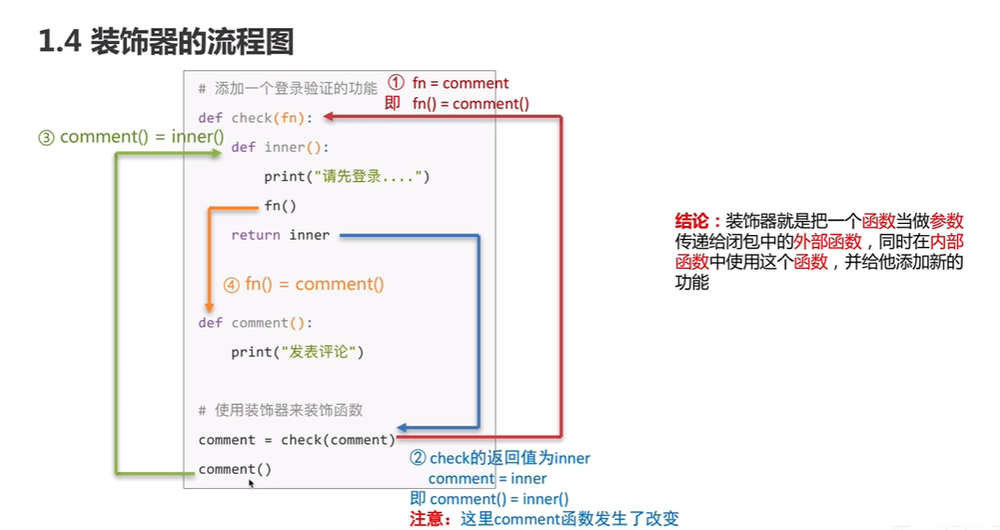

### 2、装饰器使用场景

装饰器装饰带有参数的函数：

~~~python
def logging (fn):
  def inner(a,b):
    fn(a,b)
  return inner 
# 使用装饰器装饰函数
@logging
def sum_num(a,b):
  result = a+b
  print(result)

sum_num(1,2) # 输出 3
~~~

