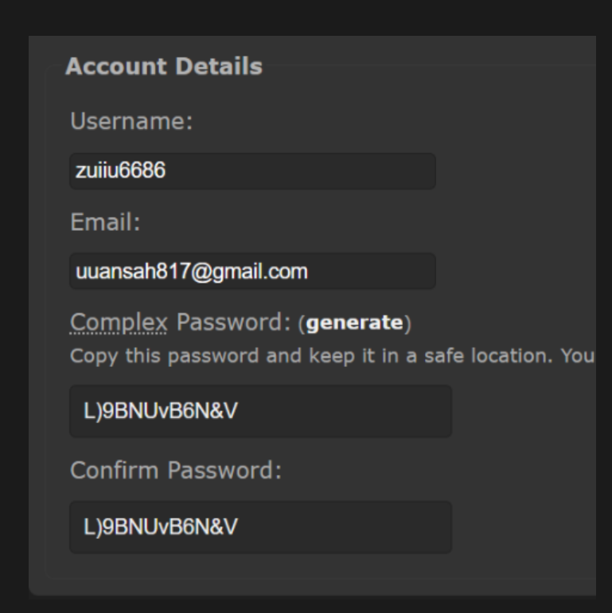
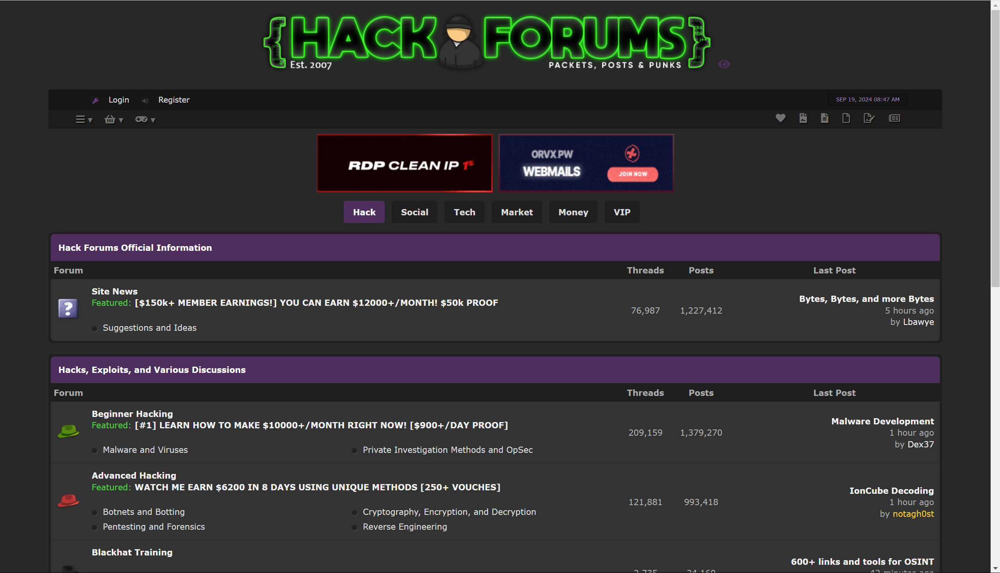
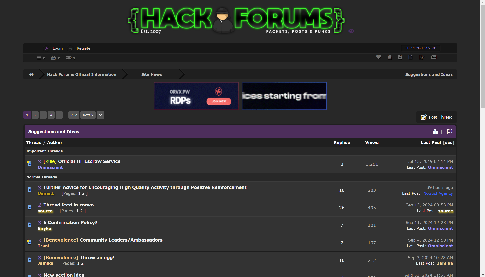
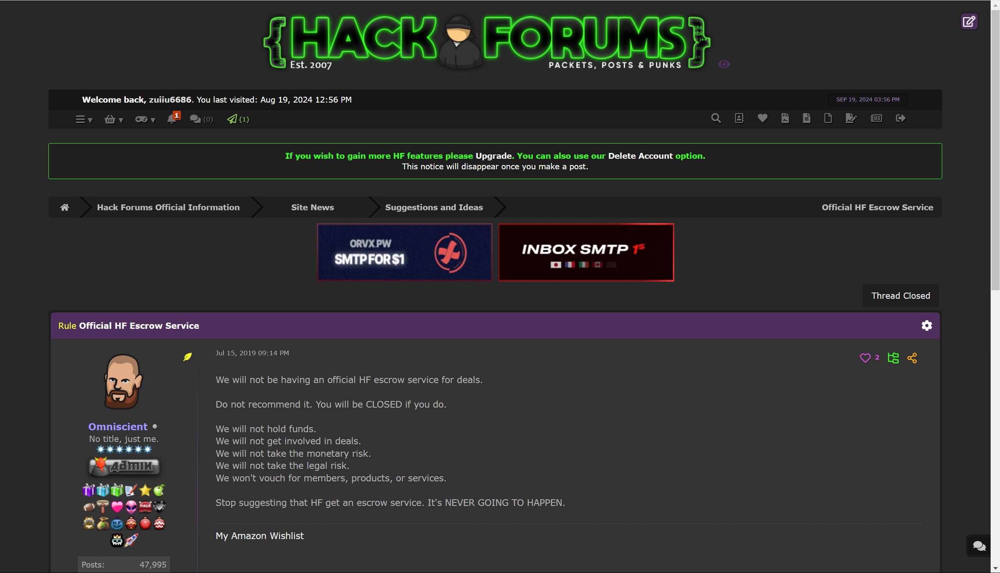
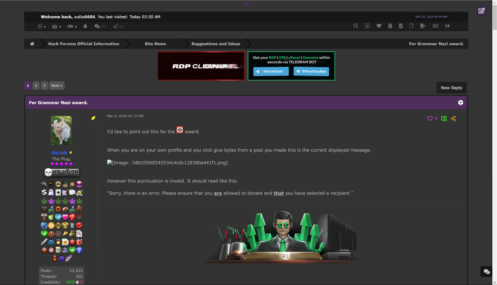
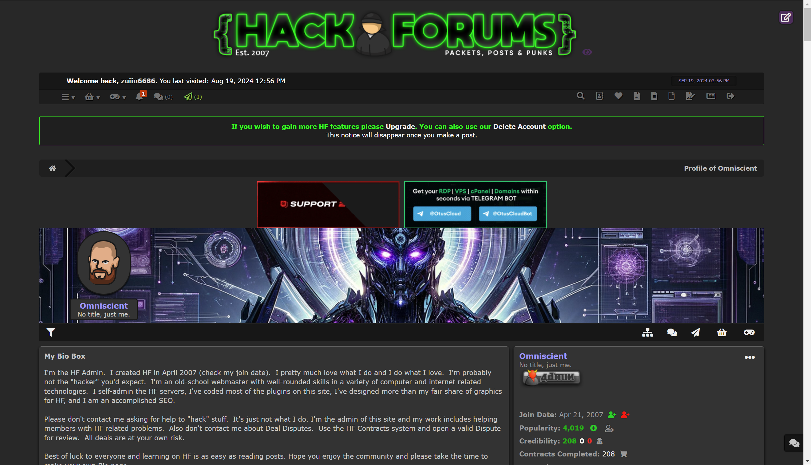
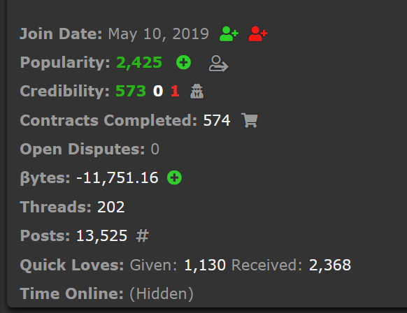

hack_forum:  https://hackforums.net/

user:zuiiu6686

password:L)9BNUvB6N&V

网站进入主页面：

主页面内容包括：

- 各个模块名称

- 各个模块下论坛名称

- 各个论坛的Threads数量、post数量、最后发的帖子、最后发帖人、最后发帖时间   

- 注：post中算回复数量   Threads数量对不上 （难道是包括有史以来发的并且删掉的帖子？

- 注：我自己发了个帖子  Threads数量+=1  但是找不到删帖子的地方  大概是不允许删？

  

包含Hack、Social、Tech、Market、Money、VIP六大模块

每个模块下包含有一些不确定数量的Forum论坛，每个论坛可单独分别点击进入

以Hack的Site News为例：

https://hackforums.net/forumdisplay.php?fid=2&page=1

论坛主页包括：

- 各个帖子
- 每条帖子包括 发帖人、发帖的名称、回复数、观看数、发帖时间、最后回答人（若无评论回复，则默认为发帖人）
- 注：important Threads 基本上是管理员发的

点击forum可进论坛，然后可看到一些帖子，帖子有很多页，在登录过后才可以进入查看

帖子内容：

可以**拿到里面的评论**

同时点击用户头像可以进入用户个人主页

用户个人主页

用户信息包括：

- 加入时间
- 流行数？
- 可靠度
- 发帖数
- 回复数

爬起流程：

需要数据库表：

user表、

1. 从Hack版块开始，依次爬取各个版块
2. 选择一个版块，以Hack版块为例
3. 依次点击进入各个forum
4. 依次从上往下点击forum中帖子爬取
5. 拿取每页各个用户的发言
6. 照理说  一条评论就有一个用户  就能获得一个用户信息，但是照这个想法会有重复用户信息入库（对对，就这样，后面就能直接筛选用户名查看到他在什么帖子下发言以及发言内容了

user表字段：

1.id  

1. module 模块名   即属于哪个大模块
2. fourm_thead 紫色模块名称
3. fourm_thead_url  紫色模块url
4. forum 论坛名   即属于哪个论坛
5. forum_url  论坛url
6. forum_threads 论坛帖子数量
7. forum_posts 论坛回复数量
8. forum_last_post_thread 论坛最后回复帖子
9. forum_last_post_time 论坛最后回复时间
10. forum_last_post_user 论坛最后回复人
11. thread 帖子名   即属于哪个帖子 
12. thread_url 帖子链接
13. thread_user_name 发帖人  
14. thread_replies 帖子回复数量
15. thread_view 帖子查看数量
16. thread_last_post_time 最后回复时间
17. thread_last_post_user 最后回复人
18. post_id  回复post的id
19. user_url 用户主页链接
20. user_name 用户名
21. user_last_seen 最后查看时间  //
22. user_join_date 加入时间  //
23. user_popularity 流行度
24. user_credibility 可靠度、可信度
25. user_contracts_completed 完成的合同  //
26. user_open_disputes  //
27. user_bytes
28. user_threads
29. user_posts
30. user_quick_loves  //
31. user_time_online   //
32. user_game_xp
33. post_content  回复内容

