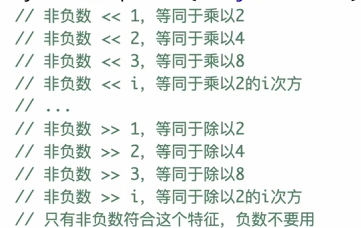

## 二进制和位运算

### 1、二进制和位的概念

二进制：010101011

1. 

### 2、正数怎么使用二进制表达

二进制：010101011

### 3、负数用二进制表达

负数二进制：（0正1负符号位）

1. 十进制变二进制：正数二进制、减一、全部按位取反
2. 二进制变十进制：全部取反、各位加一、得到无符号数，再加个负号

二进制负数设计如此的原因：与正数相加用同一套进位

例：

1. -5+2：
   - -5：正二：0101	减一：0100	取反：1011
   - 2：0010
   - -5+2：1101
   - 1101：取反：0010    加一：0011    加负号-3
2. -5+7：
   - -5：正二：0101	减一：0100	取反：1011
   - 7：0111
   - -5+7：0010 = 2

### 4、打印二进制；直接定义二进制、十六进制的变量

int、long最小值，取相反数、绝对值，都是自己

定义二进制：0b1010101

定义十六进制：0x6e

### 5、常见位运算

（|、&、^、~、<<、>>、>>>）

1. ~

   a全部按位取反

   十进制相反数：~a + 1

2. |

   有1就是1

3. &

   都是1才是1

4. ^

   两位相同则是1

5. '<<'

   

6. '>>'和'>>>'

   对于非负数效果一样

   负数：

   - '>>'：用符号位补
   - '>>>'：用0补

   

