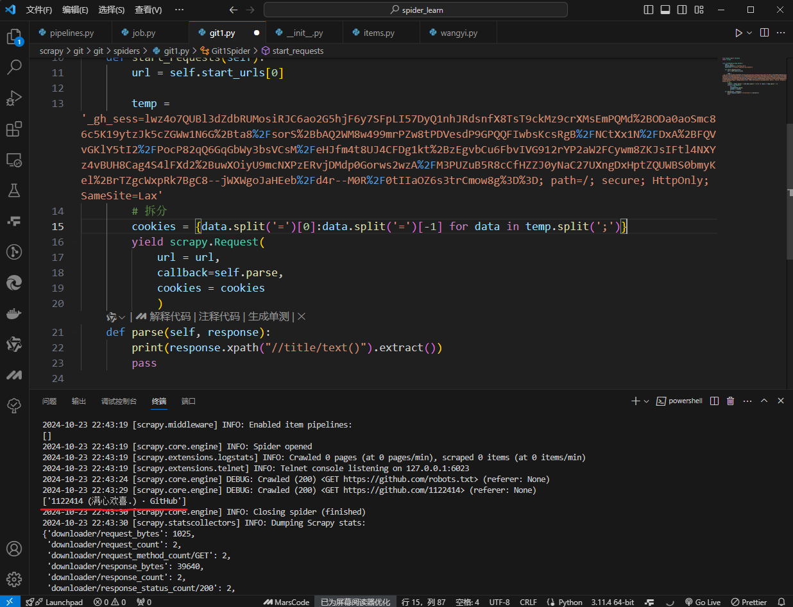

### cookie类型的字符串拆分

~~~python
temp = '_gh_sess=lwz4o7QUBl3dZdbRUMosiRJC6ao2G5hjF6y7SFpLI57DyQ1nhJRdsnfX8TsT9ckMz9crXMsEmPQMd%2BODa0aoSmc86c5K19ytzJk5cZGWw1N6G%2Bta8%2FsorS%2BbAQ2WM8w499mrPZw8tPDVesdP9GPQQFIwbsKcsRgB%2FNCtXx1N%2FDxA%2BFQVvGKlY5tI2%2FPocP82qQ6GqGbWy3bsVCsM%2FeHJfm4t8UJ4CFDg1kt%2BzEgvbCu6FbvIVG912rYP2aW2FCywm8ZKJsIFtl4NXYz4vBUH8Cag4S4lFXd2%2BuwXOiyU9mcNXPzERvjDMdp0Gorws2wzA%2FM3PUZuB5R8cCfHZZJ0yNaC27UXngDxHptZQUWBS0bmyKel%2BrTZgcWxpRk7BgC8--jWXWgoJaHEeb%2Fd4r--M0R%2F0tIIaOZ6s3trCmow8g%3D%3D; path=/; secure; HttpOnly; SameSite=Lax'

# 拆分
cookies = {data.split('=')[0]:data.split('=')[-1] for data in temp.split(';')}
~~~

