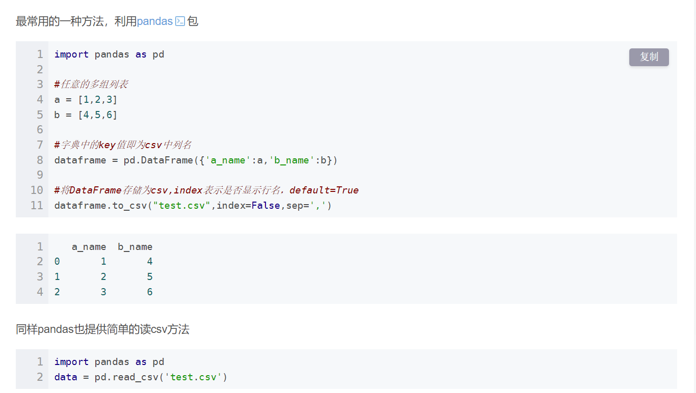

### python写入csv文件

~~~python
full_path = os.path.join(current, 'douban_comments.csv')  
datadrame = pd.DataFrame({'comment_user_name':comment_user_name,'comment':comment})
datadrame.to_csv(full_path,mode='a',header=False,index=False,encoding='utf-8-sig')
~~~

