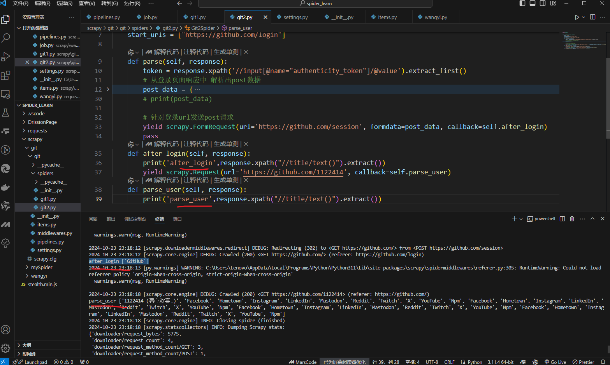

## 1.安装scrapy

命令：

​	sudo apt-get install scrapy

或者：

​	pip/pip3 install scrapy

## 2.scrapy项目开发流程

1. 创建项目：

   scrapy startproject mySpider

2. 生成爬虫：

   scrapy genspider itcast itcast.cn

3. 提取数据：

   根据网站结构在spider中实现数据采集相关内容

4. 保存数据：

   使用pipeline进行数据后续处理和保存

## 3.创建项目

**创建scrapy项目的命令：**

​	scrapy startproject <项目名称>

示例：

​	scrapy startproject mySpider

**各个文件作用：**

1. items.py	自己预计需要爬取的内容
2. middlewares.py   自定义中间件的文件
3. pipelines.py   管道，保存数据
4. settings.py   设置文件、UA、启动管道
5. spiders   自定义的spider的文件夹

## 4.创建爬虫

通过命令创建出爬虫文件，爬虫文件为账户要的代码作业文件，通常一个网站的爬取动作都会在爬虫文件中进行编写

**命令：**

​	在项目路径下执行：

​	scrapy genspider <爬虫名字><允许爬取的域名>

**爬虫名字：**作为爬虫运行时的参数

**允许爬取的域名：**为对于爬虫设值的爬取范围，设值之后用于过滤要爬取的url，如果爬取的url与允许的域不通过则被过滤掉

示例：

~~~cmd
cd mySpider
scrapy genspider itcast itcast.cn
~~~

## 5.完善爬虫

1. 修改起始url
2. 检查修改允许的域名
3. 在parse中解析 

### 5.1

1. scrapy.Spider爬虫类中必须有名为parse的解析
2. 如果网站层次比较复杂，可以自定义其他解析函数
3. 在解析函数中提取的url地址如果要发送秦秋，则必须属于allowed_domains范围内，但是start_urls中的url地址不受这个限制
4. 启动爬虫的时候注意启动的位置，是在项目路径下启动
5. parse()函数中使用yield返回数据，注：yield能传递的对象只能是BaseItem，Request，dic，None

### 5.2 定位元素以及提取数据、属性值的方法

解析并获取scrapy爬虫中的数据，利用xpath规则字符串进行定位和提取

1. response.xpath方法的返回结果是一个类似list的类型，其中包含的是selector对象，操作和列表一样，但是有些额外的方法
2. 额外方法：extract()：返回一个包含有字符串的列表
3. 额外方法：extract_first()：返回列表中的第一个字符串，列表为空返回None

### 5.3 response响应对象的常用属性

- response.url:当前响应的url地址
- response.request.url:当前响应对应请求的url
- response.headers:响应头
- response.requests.headers:当前响应的请求头
- response.body:响应体，也就是html代码，byte类型
- response.status:响应状态码

## 6.保存数据

利用管道pipeline来处理数据

### 6.1在pipelines.py文件中定义对数据的操作

1. 定义一个管道类
2. 重写管道类的process_item方法
3. process_item方法处理完item之后必须返回给引擎

## 7.scrapy数据建模与请求

学习目标：

1. 应用在scrapy项目中进行建模
2. 应用构造Request对象，并发送请求
3. 应用利用meta参数在不同的解析函数中传递数据

### 7.1数据建模

1. 为什么要建模
   1. 定义item即提前规划好哪些字段需要抓，防止手误，在定义好之后，在运行过程中，系统会自动检查
   2. 配合注释一起可以清晰知道要抓取哪些字段，没有定义的字段不能抓取，在目标字段少的时候可以使用字典代替
   3. 使用scrapy的一些特定组件需要item支持，如scrapy的ImagesPipeline管道类
2. 如何建模
   1. 在items.py文件中定义要提取的字段：
3. 如何使用模版类
   1. 模版类定义后需要在爬虫中导入并且实例化，之后使用方法和使用字典相同

## 8.开发流程总结

1. 创建项目
   1. scrapy startproject <项目名>
2. 明确目标
   1. 在items.py文件中建模
3. 创建爬虫
   1. 创建爬虫
      1. scrapy genspider 爬虫名 允许的域
   2. 完成爬虫
      1. 修改start_urls
      2. 检查修改allowed_domains
      3. 编写解析方法
4. 保存数据
   1. 在Pipeline.py中定义对数据处理的管道
   2. 在setting.py文件中注册启用管道

## 运行scrapy

命令：在项目目录下执行scrapy crawl <爬虫名字>

示例：scrapy crawl itcast

然后start_url中的网页会被自动request出去，response作为返回值

### 翻页请求思路

scrapy：

1. 找到下一页url
2. 构造url请求对象，传递给引擎
3. 构造Request对象，并发送请求
   1. 实现方法
      1. 确定url地址
      2. 构造请求，scrapy.Request(url,callback)
         - callback:指定解析函数名称，表示该请求返回的响应使用哪一个函数进行解析
      3. 把请求交给引擎：yield scrapy.Request(url,callback)
   2. 案例（案例不好，已经换方式了）
      1. 爬取网易招聘页面信息  地址：https://hr.163.com/job-list.html?workType=0   

~~~python
# 模拟翻页
part_url = ...

next_url = response.urljoin(part_url)
yield scrapy.Request(
	url = next_url,
    callback = self.parse
)
~~~

## scrapy.Request的更多参数

~~~python
scrapy.Request(url,[callback,method="GET",headers,body,cookies,meta,dont_filter=False])
~~~

1. 中括号里的参数是可选参数
2. callback：表示当前的url响应应交给哪个函数去处理
3. meta：实现数据在不同的解析函数中传递，meta默认带有部分数据，比如下载延迟，请求深度等
4. dont_filter：默认false，会过滤请求的url地址，即请求过得url地址不会被继续请求，对需要重复请求的url地址可以把它设为
5. method：指定POST或GET请求
6. headers：接收一个字典，不包括cookies
7. cookies：接收一个字典，其中专门放cookies
8. body：接收josn字符串，为POST的数据，发送payload_post请求时使用

## meta参数的使用

meta的作用：meta可以实现数据在不同的解析函数中传递

在爬虫文件的parse方法中，提取详情页增加之前callback指定的parse_detail函数：

~~~python
def parse(self,response):
	...
    yield scrapy.Request(detail_url,callback=self.parse_detail,meta("item":item))
    ...
def parse_detail(self,response):
    # 获取之前传入的item
    item = response.meta["item"]
~~~

特别注意：

1. meta参数是一个字典
2. meta字典中有一个固定的键proxy，表示代理ip

## scrapy模拟登陆

学习目标：

1. 应用请求对象cookies参数的使用
2. 了解start_requests函数的作用
3. 应用构造并发送post请求

### 1.回顾之前的模拟登陆方法

1. requests模块是如何实现模拟登录的？
   1. 直接携带cookies请求页面
   2. 找url地址，发送posr请求存储cookies
2. selenium是如何模拟登录的？
   1. 找到对应input标签，输入文本点击登录
3. scrapy的模拟登录
   1. 直接携带cookies
   2. 找到url，发送post请求存储cookies

### 2.scrapy携带cookies直接获取需要登录后的页面

应用场景

1. cookie过期时间长
2. 能在cookie过期之前把所有数据拿到
3. 配合其他程序使用，比如使用selenium把登录之后的cookie获取保存到本地，scrapy发送请求之前先读取本地cookie

### 3.scrapy.Request发送post请求

scrapy中可以使用scrapy.Request()指定method、body参数来发送post请求；但是通常使用scrapy.FormRequest()发送post请求

1. 发送post请求
   1. 注意：scrapy.FormRequest()能够发送表单和ajax请求
   2. 思路分析
      1. 找到post的url地址：点击登录按钮进行抓包，然后定位url地址为https://github.com/session
      2. 找到请求体的规律：分析post请求的请求体，其中包含的参数均在前一次的响应中
      3. 是否登录成功：通过请求个人主页，观察是否包含用户名

## crawlspider类

继承自Spider爬虫类

自动根据规则提取链接并发送给引擎

1. 创建crawlspider爬虫
   1. scrapy genspider [-t crawl] nmae domains

## scrapy中间件使用

学习目标：

1. 应用scrapy中间件使用后随机UA的方法
2. 应用scrapy中使用代理IP的方法
3. 应用scrapy与selenium相结合使用

### 1.scrapy中间件的分类与作用

#### 1.1 scrapy中间件的分类

根据scrapy运行流程中不同位置可以分为：

1. 下载中间件
2. 爬虫中间件

#### 1.2 scrapy中间件作用，预处理Request和response对象

1. 对header以及cookie进行变换和处理
2. 使用代理ip等
3. 对请求进行定制化操作

但在scrapy默认情况下，两种中间件都在middlewares.py一个文件中

爬虫中间件使用方法和下载中间件相同，且功能重复，通常使用下载中间件

### 2.下载中间件的使用方法：

~~~text
通过下载中间件来学习如何使用中间件，编写一个Downloader Middlewares和编写一个Pipeline一样，定义一个类，然后在setting中开启
~~~

Downloder Middlewares默认方法：

- process_request(self,request,spider):
  1. 当每个Request通过下载中间件时，该方法被调用
  2. 返回None值，没有return也是返回None，该Request对象传递给下载器，或通过引擎传递给其他权重低的process_request方法
  3. 返回Response对象：不再请求，把Response返回给引擎
  4. 返回Request对象：把Request对象通过引擎交给调度器，此时将不再通过其他权重低的process_request方法
- process_response(self,response,spider):
  1. 当下载器完成http请求，传递响应给引擎的时候调用
  2. 返回Response：通过引擎交给爬虫处理或交给权重更低的其他下载中间件process_Response方法
  3. 返回Response对象：通过引擎交给调取器继续请求，此时将不通过其他权重低的process_Request方法
- 在setting.py中配置开启中间件，权重值越小越先执行

#### 2.1中间件-随机请求头

~~~python
USER_AGENT = [
      "Mozilla/5.0 (Macintosh; Intel Mac OS X 10_15_7) AppleWebKit/537.36 (KHTML, like Gecko) Chrome/125.0.0.0 Safari/537.36",
    "Mozilla/5.0 (Windows NT 6.1) AppleWebKit/537.36 (KHTML, like Gecko) Chrome/41.0.2228.0 Safari/537.36",
    "Mozilla/5.0 (Macintosh; Intel Mac OS X 10_10_1) AppleWebKit/537.36 (KHTML, like Gecko) Chrome/41.0.2227.1 Safari/537.36",
    "Mozilla/5.0 (X11; Linux x86_64) AppleWebKit/537.36 (KHTML, like Gecko) Chrome/41.0.2227.0 Safari/537.36",
    "Mozilla/5.0 (Windows NT 6.1; WOW64) AppleWebKit/537.36 (KHTML, like Gecko) Chrome/41.0.2227.0 Safari/537.36",
    "Mozilla/5.0 (Windows NT 6.3; WOW64) AppleWebKit/537.36 (KHTML, like Gecko) Chrome/41.0.2226.0 Safari/537.36",
    "Mozilla/5.0 (Windows NT 6.4; WOW64) AppleWebKit/537.36 (KHTML, like Gecko) Chrome/41.0.2225.0 Safari/537.36",
    "Mozilla/5.0 (Windows NT 6.3; WOW64) AppleWebKit/537.36 (KHTML, like Gecko) Chrome/41.0.2225.0 Safari/537.36",
    "Mozilla/5.0 (Windows NT 5.1) AppleWebKit/537.36 (KHTML, like Gecko) Chrome/41.0.2224.3 Safari/537.36",
    "Mozilla/5.0 (Windows NT 10.0) AppleWebKit/537.36 (KHTML, like Gecko) Chrome/40.0.2214.93 Safari/537.36",
    "Mozilla/5.0 (Macintosh; Intel Mac OS X 10_10_1) AppleWebKit/537.36 (KHTML, like Gecko) Chrome/37.0.2062.124 Safari/537.36",
    "Mozilla/5.0 (Windows NT 6.3; Win64; x64) AppleWebKit/537.36 (KHTML, like Gecko) Chrome/37.0.2049.0 Safari/537.36",
    "Mozilla/5.0 (Windows NT 4.0; WOW64) AppleWebKit/537.36 (KHTML, like Gecko) Chrome/37.0.2049.0 Safari/537.36",
    "Mozilla/5.0 (Windows NT 6.1; WOW64) AppleWebKit/537.36 (KHTML, like Gecko) Chrome/36.0.1985.67 Safari/537.36",
    "Mozilla/5.0 (X11; Linux x86_64) AppleWebKit/537.11 (KHTML, like Gecko) Chrome/23.0.1271.64 Safari/537.11",
    "Mozilla/5.0 (Windows NT 5.1) AppleWebKit/537.36 (KHTML, like Gecko) Chrome/36.0.1985.67 Safari/537.36",
    "Mozilla/5.0 (X11; OpenBSD i386) AppleWebKit/537.36 (KHTML, like Gecko) Chrome/36.0.1985.125 Safari/537.36",
    "Mozilla/5.0 (Macintosh; Intel Mac OS X 10_9_2) AppleWebKit/537.36 (KHTML, like Gecko) Chrome/36.0.1944.0 Safari/537.36",
    "Mozilla/5.0 (Windows NT 5.1) AppleWebKit/537.36 (KHTML, like Gecko) Chrome/35.0.3319.102 Safari/537.36",
    "Mozilla/5.0 (Windows NT 5.1) AppleWebKit/537.36 (KHTML, like Gecko) Chrome/35.0.2309.372 Safari/537.36",
    "Mozilla/5.0 (Windows NT 5.1) AppleWebKit/537.36 (KHTML, like Gecko) Chrome/35.0.2117.157 Safari/537.36",
    "Mozilla/5.0 (Macintosh; Intel Mac OS X 10_9_3) AppleWebKit/537.36 (KHTML, like Gecko) Chrome/35.0.1916.47 Safari/537.36",
    "Mozilla/5.0 (Windows NT 5.1) AppleWebKit/537.36 (KHTML, like Gecko) Chrome/34.0.1866.237 Safari/537.36",
    "Mozilla/5.0 (X11; Linux x86_64) AppleWebKit/537.36 (KHTML, like Gecko) Chrome/34.0.1847.137 Safari/4E423F",
    "Mozilla/5.0 (Windows NT 5.1) AppleWebKit/537.36 (KHTML, like Gecko) Chrome/34.0.1847.116 Safari/537.36",
    "Mozilla/5.0 (X11; Linux x86_64) AppleWebKit/537.36 (KHTML, like Gecko) Chrome/33.0.1750.517 Safari/537.36",
    "Mozilla/5.0 (Windows NT 6.2; Win64; x64) AppleWebKit/537.36 (KHTML, like Gecko) Chrome/32.0.1667.0 Safari/537.36",
    "Mozilla/5.0 (Macintosh; Intel Mac OS X 10_9_0) AppleWebKit/537.36 (KHTML, like Gecko) Chrome/32.0.1664.3 Safari/537.36",
    "Mozilla/5.0 (Macintosh; Intel Mac OS X 10_8_0) AppleWebKit/537.36 (KHTML, like Gecko) Chrome/32.0.1664.3 Safari/537.36",
    "Mozilla/5.0 (Windows NT 5.1) AppleWebKit/537.36 (KHTML, like Gecko) Chrome/31.0.1650.16 Safari/537.36",
    "Mozilla/5.0 (Windows NT 6.1; WOW64) AppleWebKit/537.36 (KHTML, like Gecko) Chrome/31.0.1623.0 Safari/537.36",
    "Mozilla/5.0 (Windows NT 6.2; WOW64) AppleWebKit/537.36 (KHTML, like Gecko) Chrome/30.0.1599.17 Safari/537.36",
    "Mozilla/5.0 (Windows NT 6.1; WOW64) AppleWebKit/537.36 (KHTML, like Gecko) Chrome/29.0.1547.62 Safari/537.36",
    "Mozilla/5.0 (X11; CrOS i686 4319.74.0) AppleWebKit/537.36 (KHTML, like Gecko) Chrome/29.0.1547.57 Safari/537.36",
    "Mozilla/5.0 (Windows NT 6.2; WOW64) AppleWebKit/537.36 (KHTML, like Gecko) Chrome/29.0.1547.2 Safari/537.36",
    "Mozilla/5.0 (Windows NT 6.1) AppleWebKit/537.36 (KHTML, like Gecko) Chrome/28.0.1468.0 Safari/537.36",
    "Mozilla/5.0 (Windows NT 6.2) AppleWebKit/537.36 (KHTML, like Gecko) Chrome/28.0.1467.0 Safari/537.36",
    "Mozilla/5.0 (Windows NT 6.2) AppleWebKit/537.36 (KHTML, like Gecko) Chrome/28.0.1464.0 Safari/537.36",
    "Mozilla/5.0 (Windows NT 6.2; WOW64) AppleWebKit/537.36 (KHTML, like Gecko) Chrome/27.0.1500.55 Safari/537.36",
    "Mozilla/5.0 (Windows NT 6.2; WOW64) AppleWebKit/537.36 (KHTML, like Gecko) Chrome/27.0.1453.93 Safari/537.36",
    "Mozilla/5.0 (Windows NT 6.1; WOW64) AppleWebKit/537.36 (KHTML, like Gecko) Chrome/27.0.1453.93 Safari/537.36",
    "Mozilla/5.0 (Windows NT 6.1) AppleWebKit/537.36 (KHTML, like Gecko) Chrome/27.0.1453.93 Safari/537.36",
    "Mozilla/5.0 (Windows NT 5.1) AppleWebKit/537.36 (KHTML, like Gecko) Chrome/27.0.1453.93 Safari/537.36",
    "Mozilla/5.0 (Macintosh; Intel Mac OS X 10_8_3) AppleWebKit/537.36 (KHTML, like Gecko) Chrome/27.0.1453.93 Safari/537.36",
    "Mozilla/5.0 (Macintosh; Intel Mac OS X 10_7_5) AppleWebKit/537.36 (KHTML, like Gecko) Chrome/27.0.1453.93 Safari/537.36",
    "Mozilla/5.0 (Windows NT 6.1) AppleWebKit/537.36 (KHTML, like Gecko) Chrome/27.0.1453.90 Safari/537.36",
    "Mozilla/5.0 (X11; NetBSD) AppleWebKit/537.36 (KHTML, like Gecko) Chrome/27.0.1453.116 Safari/537.36",
    "Mozilla/5.0 (X11; CrOS i686 3912.101.0) AppleWebKit/537.36 (KHTML, like Gecko) Chrome/27.0.1453.116 Safari/537.36",
    "Mozilla/5.0 (Windows NT 6.1; WOW64) AppleWebKit/537.17 (KHTML, like Gecko) Chrome/24.0.1312.60 Safari/537.17",
    "Mozilla/5.0 (Macintosh; Intel Mac OS X 10_8_2) AppleWebKit/537.17 (KHTML, like Gecko) Chrome/24.0.1309.0 Safari/537.17"
]
~~~

在middlewares中间件文件中加入

~~~python
# 定义一个中间件类
class RandomUserAgent(object):
    def process_request(self, request, spider):
        # print(request.headers)
        ua = random.choice(USER_AGENT)
        request.headers['User-Agent'] = ua
        pass
~~~

#### 2.2 代理IP使用

在settings文件中加入PROXY_LIST=[{}]代理

#### 2.3中间件使用selenium

主要是等待页面渲染

~~~python
class SeleniumMiddleware(object):
    def process_request(self,request,spider):
		if 'daydata' in url:
            driver = webdriver.Chrome()
            driver.get(url)
            time.sleep(3)
            data = driver.page_source
            
            driver.close()
            
            res = HtmlResponse(url=url,body=data,encoding='utf-8',request=request)
            return res
~~~

#### 2.4scrapy_redis概念作用和流程

学习目标：

1. 了解scrapy_redis的概念
2. 了解scrapy_redis的作用
3. 了解scrapy_redis的工作流程

##### 1.分布式是什么

简单来说，分布式就是不同节点（服务器、ip不同）共同完成一个任务

##### 2.scrapy_redis概念

scrapy_redis是scrapy框架基于redis的分布式组件

##### 3.scrapy_redis作用