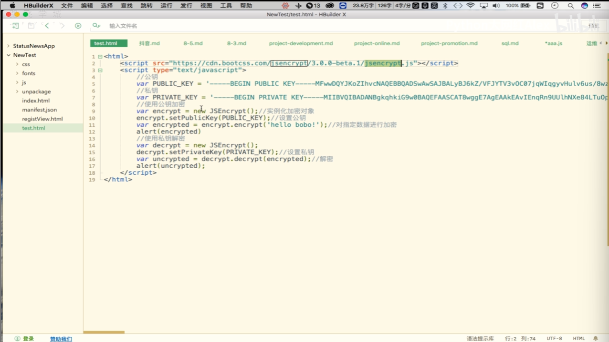

### RSA加密

- RSA加密：
  - RSA加密算法是一种非对称加密算法。在公开密钥加密和电子商业中RSA被广泛应用
- 非对称加密算法：
  - 非对称加密算法需要两个密钥：
    - 公开密钥（publickey：简称公钥）
    - 私有密钥（privatekey：简称私钥）
    - 公钥与私钥是一对，如果用公钥对数据进行加密，只有用对应的私钥才能解密。因为加密和解密使用的是两个不同的密钥，所以这张算法叫做非对称加密算法
  - 注意：
    - 使用时都是使用公钥加密使用私钥解密。公钥可以公开，私钥自己保留
    - 算法强度复杂、安全性依赖于算法与密钥但是由于其算法复杂，而使得加密解密速度没有对称加密解密速度快
  - 使用流程和场景介绍
    - 通过公钥加密，使用私钥解密。私钥是通过公钥计算生成的。假设ABC三方之间相互进行加密通信。大家相互之间使用公钥进行信息加密，信息读取时使用各自对应的私钥进行信息解密
    - 用户输入的支付密码会通过RSA加密
  - 公钥私钥生成方式：
    - 公私钥可以在线生成
      - http://web.chacuo.net/netrsakey.pair

注意：setPublicKey和setPrivateKey