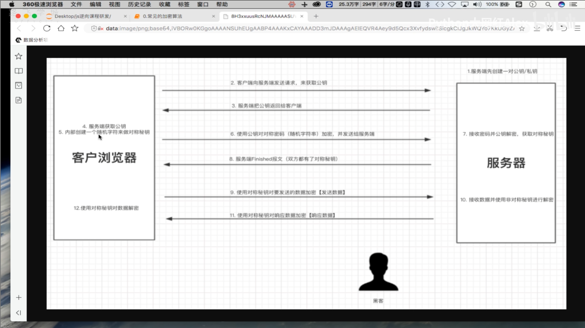
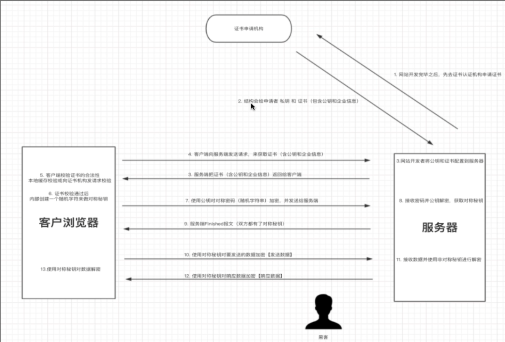

### https加密

- https是基于https和SSL/TLS实现的一个协议，他可以保证在网络上传输的数据都是加密的，从而保证数据安全。
- 接下来我们从http协议开始，提出想法并逐步进行分析，最终实现Https。

- 1.http协议是不安全的。
  - 在https诞生之前，所有网站都使用http协议，而htto协议在数据传输过程中都是明文，所以可能存在数据泄露和篡改。
- 2.使用对称密钥进行数据加密
  - 为了防止数据泄密和篡改，我们对数据进行加密，如：生成一个对称密码【DKUFHNAF897123F】，将对称密钥分别交给浏览器和服务器端，他们传输的数据都是用对称密钥进行数据加密和解密。
- 请求和响应流程如下：
  - 客户端使用对称密钥对请求进行加密，并发送给服务端
  - 服务端接受密文之后，使用对称密钥对密文进行解密，然后处理请求。最后再使用对称密钥把要返回的内容再次加密，返回客户端
  - 客户端接受到密文之后，使用对称密钥进行解密，并获取最终的响应内容
- 如此一来，数据传输都是密文，解决了明文传输数据的问题，但是这样有bug
  - 浏览器如何获取对称密钥？
  - 每个客户端的对称密钥相同，浏览器能拿到对称密钥，黑客也能拿到，所以此时数据加密无意义
- 动态对称密钥和非对称密钥
  - 为了解决对称密钥动态性以及让客户端和服务端安全的获取对称密钥，可以引入非对称密钥机制

