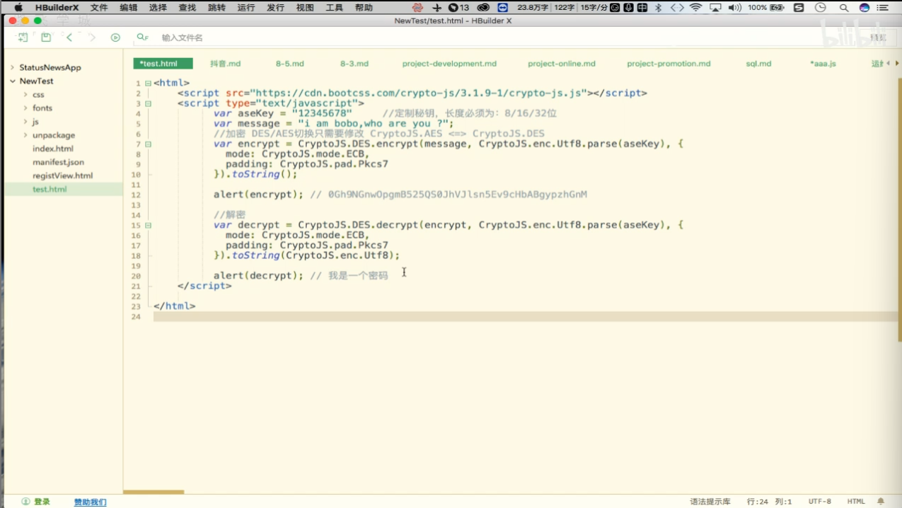

### DES/AES加密

- DES全称Data Encryption Standard，即数据加密标准，是一种使用密钥加密的算法。该加密算法是一种对称加密方式，其加密、解密运算需要使用的是同样的密钥（一组字符串）即可。

- 注意：
  - 现在使用AES标准来替代原先的DES。
  - AES和DES的区别：
    - DES加密后密文长度是8的整数倍
    - AES加密后密文长度是16的整数倍
  - 应用场景的不同：
    - 企业级开发使用DES足够安全
    - 如果要求高使用AES
  - DES和AES切换只需要修改CrypoJS.AES<=>CryptoJS.DES
- 使用DES/AES进行数据交互时要求双方都拥有相同的私钥
- 破解：
  - 暴力破解
  - DES如果使用65位密钥，则可能的密钥数量为2的56次方。只要计算足够强大是可以被破解的

