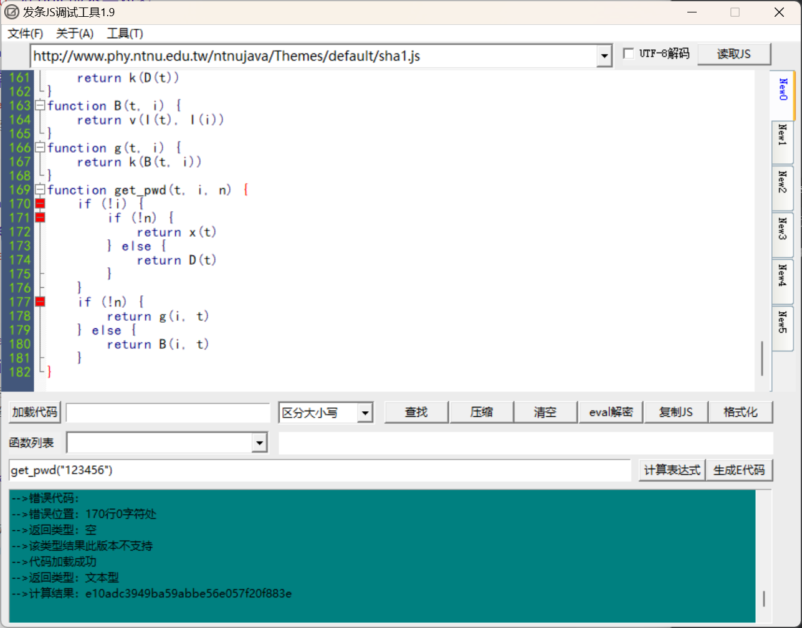
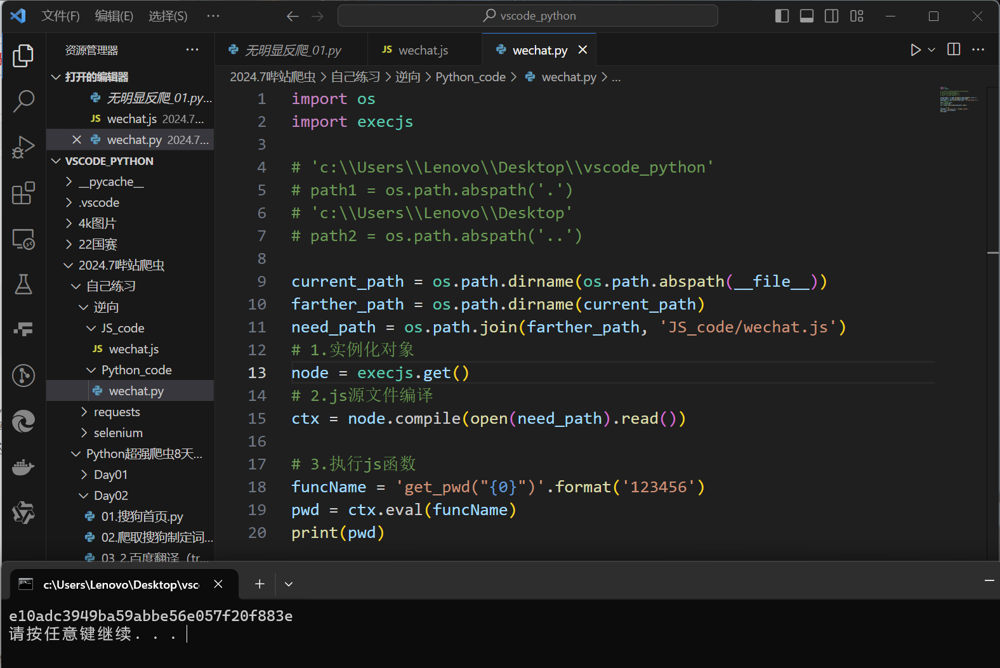

微信公众平台

1. 抓包发现  一样的密码 md5加密是一样的
2. 多打断点

第一次尝试：成功

注意点：

1. 注意哪个才是主要程序入口
2. 发条JS调试工具运行步骤：
   1. 粘贴代码
   2. 格式化
   3. 加载代码
   4. 在下面空白处输入
   5. 注：每次更改代码都需要重新加载代码

小试牛刀-微信公众平台js算法逆向

- js调试工具
  - 发条js调试工具
- PyExecJs
  - 实现使用python执行js代码
  - 环境安装
    1. nodejs开发环境
    2. pip install PyExecJs
- js算法改写初探
  - 打断点
  - 代码调试时，如果发现了相关变量的确实，一般给其定义成空字典即可

