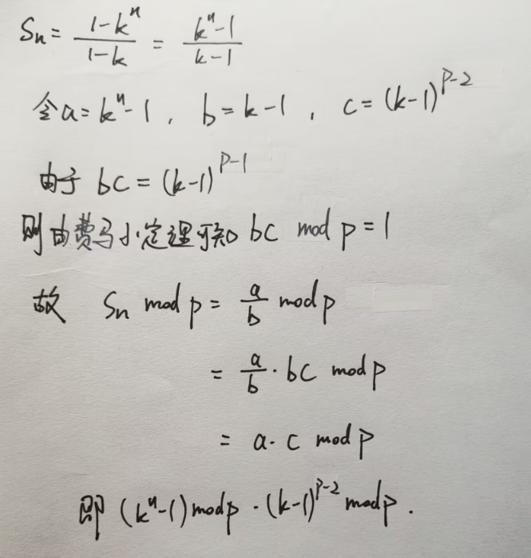

### 费马小定理

费马小定理：若p为素数，则对于任意整数a，有a^(p-1)≡1(mod p)。

### 逆元（一句话就是，将除法改为乘法

设c是b的逆元，则有**b*c≡1(mod m)**；

推论：(a/b)mod m = (a/b)*1mod m = (a/b)*b*c mod    ：此处(a/b)*1% m -> 1%m = b*c%m

m=a*c(mod m); 即a/b的模等于a * (b的逆元)的模；

**当模数p为质数，且b与p互质，b的乘法逆元为b^(p-2)。**

**对等比数列 1+a+a^ 2 +a^ 3+……+a^ n，结果对质数p取模，a-1与p不互质，那么上面的定理2就不能使用了。但是可以发现，a%p≡1 (mod p)。所以原式就变成了 n+1。**