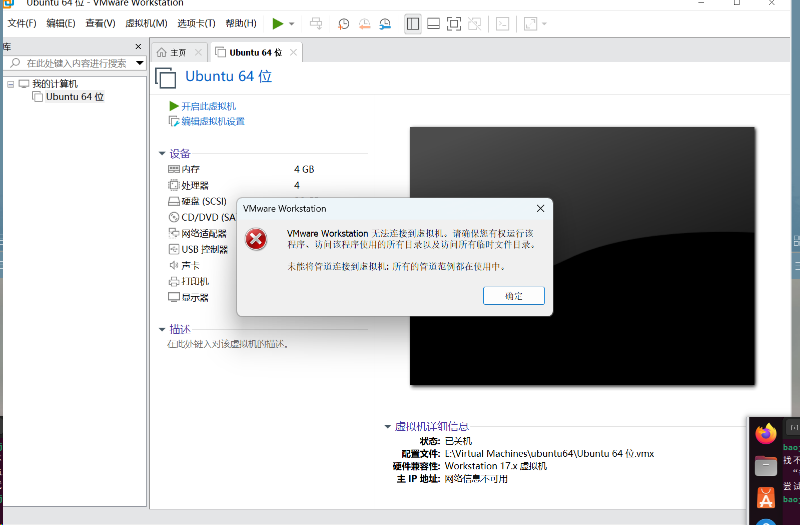

### 检查了Nat等配置均没错

VMware版本：17.0.1

Ubuntu版本：24.04.1

解决过程中问题：

1. 在启动Ubuntu时卡到桌面不能动，关闭虚拟机设置->显示器设置->3D加速；

2. 删掉Ubuntu之后重装，但是在装过程中碰到一个错位，提示没有权限打开甚至删除虚拟机，（大概率是强制关闭虚拟机时破坏了什么东西；

   

最终解决：找了挺多方法没能解决的，网上说的好多命令在Ubuntu里面不能使用，最后还是删除VMware重装，稍微有点玄学了哈

### 右上角网络出现问号

重启VMware  又是玄学了属于是